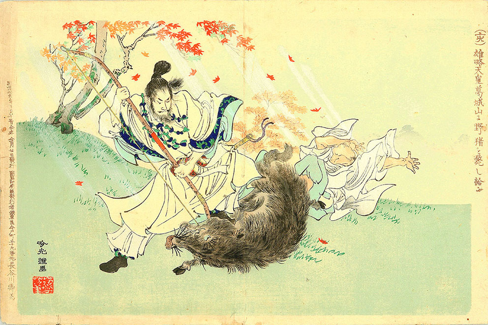
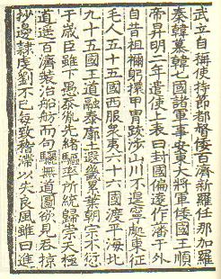
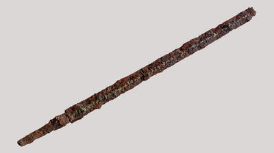
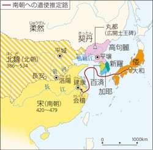
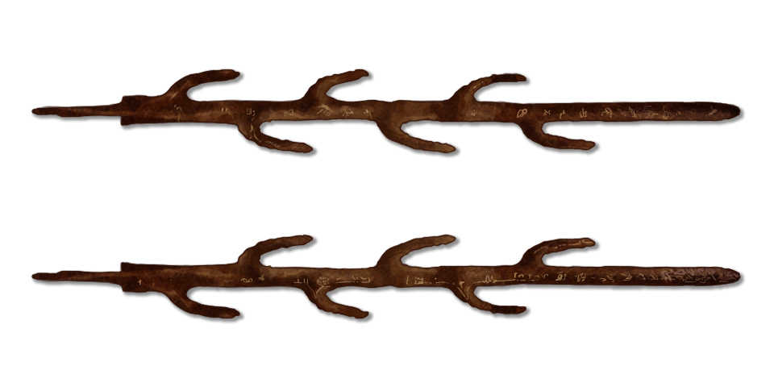

# 雄略天皇

雄略天皇は五世紀の人物です。中国の歴史書（＝宋書倭国伝）では、「倭王武」と記載されており、埼玉県の稲荷山古墳から出土した辛亥名鉄剣の銘文に見える「獲加多支鹵大王」が「記紀」にいう「ワカタケル」天皇すなわち雄略天皇であることはほぼ確実だと考えられています。

猪狩りをする雄略天皇（安達吟光画）

出典 Wikipedia

## 宋書倭国伝

宋書倭国伝には、倭の五王（大和政権の大王（おおきみ））が、中国に認めてもらい朝鮮半島に対する影響力を強めて、国（ヤマト政権）を発展させようとした経緯が記されています。

    …興死して弟武立つ。自ら使持節都督倭・百済・新羅・任那・加羅・秦韓・慕韓七国く諸軍事安東大将軍倭国王称す。

## 稲荷山古墳から出土した辛亥名鉄剣

出典 埼玉県立さきたま史跡の博物館

辛亥年とは、西暦 471 年のことで、このことから、倭王武＝ワカタケル天皇であることが読み取れます。

# 冊封体制と 5 世紀の東アジア

478 年、倭王武こと雄略天皇は、当時、南北朝時代であった中国の南朝の宋に朝貢しました。朝貢とは一部の王のみに許されていたことでした。朝貢を認められ、臣下にある周辺の従属国の王として保護を受けることを冊封体制とよびます。冊封を受けた従属国は、受けていない国に対して中国皇帝の権威を後ろ盾にすることができ、もし他の従属国から責められた場合は、中国が守ってくれるという関係でもありました。

5 世紀の東アジア

出典 ４～５世紀の東アジア(『新日本史』26 頁、カラー)

雄略天皇は、中国の権威を借りて、朝鮮半島南部の諸国に対する政治的・軍事的な優位を確保しようとして朝貢しました。一方、百済も同様の理由で宋とは冊封関係にあったため、百済を除く六カ国の指揮権をヤマト政権（倭国）に対して与えました。

宋（南宋）は当時、北魏（北宋）と敵対関係にあったため、戦力を増やすためにヤマト政権（倭国）や百済を冊封関係に置こうとしていました。百済と倭国は当時良好な関係にありました。奈良県石上神宮が所蔵している七支刀（国宝）は、四世紀に百済王から贈られたものです。加えて、六世紀には百済から、儒教・仏教・歴訪なども伝わりました。

出典 [刀剣ワールド 石上神宮と古代の鉄剣 七支刀（しちしとう）](https://www.touken-world.jp/tips/32778/)

伽耶は日本書紀では、任那と呼ばれていて、小国連合的なものでした。当時大和政権はこの地と密接な関係をもっていました。鉄資源などを確保していました。

# 渡来人の編成化（部）

475 年、倭と友好関係にあった百済が高句麗に攻められ、王が戦士して一度滅びました。この戦乱で多くの王族と百済の人々が倭に渡来してきます。その結果、様々な技術や文化が伝わりました。

ヤマト政権は、渡来人を部という職業集団に組織し、政権の職掌を分担させました。部はもともと百済の制度で、渡来人の組織化が官僚制度が作られる発端であったと考えられています。

# 参考

- [世界の歴史まっぷ 雄略天皇](https://sekainorekisi.com/glossary/%E9%9B%84%E7%95%A5%E5%A4%A9%E7%9A%87/)
- [埼玉県立さきたま史跡の博物館 - 金錯銘鉄剣](https://sakitama-muse.spec.ed.jp/%E9%87%91%E9%8C%AF%E9%8A%98%E9%89%84%E5%89%A3)
- [やりなおし高校日本史（ちくま新書）](https://amzn.to/3BfDHQ8)
