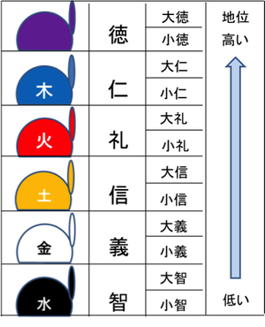
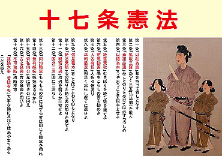

# グローバルスタンダードの輸入（飛鳥文化）

七世紀前半に、日本の神々は自然崇拝に由来する八百万の神であり非常にフレキシブルでした。グローバル（ここでいうグローバルとは、中国のことです）スタンダードである仏教文化を展開し律令国家を形成させようとしました。

明治維新のときもそうでしたが、日本は外圧や政治的な背景によって大きく変化します。宗教を輸入するというのは普通そんな簡単ではありません。

法隆寺では、飛鳥文化に影響を与えた中国の南朝様式と北魏様式の両方の仏像を見ることができます。

# 冠位十二階

冠位十二階は役人の位を 12 個に分け、位に応じて冠の色を分けました。氏や姓ではなく個人の能力に応じて役人に取り立てようと定められました。聖徳太子が身分に関係なく役人に取り立てようと政治の改革に努めたことがわかります。

# 憲法十七条

聖徳太子が役人の心構えを示すため、自ら定めたと言われている憲法です。「一に曰く、和を以て貴しと為す」。争いごとが絶えない中、聖徳太子が第一条で最初に示したのは人々の和でした。第二条では、「仏法僧」を大事にしなさい、と定めました。仏は「ほとけ」、法は「お経」、僧は「お坊さん」を表します。仏教を敬うように定め、政治に仏教を役立てることを示しました。第三条では、「詔はつつしんで受け止めなさい。」詔とは、天皇の言葉を表します。天皇に従うように命じました。

# まとめ

冠位十二階によって、家柄ではなく、個人の能力や功績に応じて冠位が与えられ、昇進可能にしたこと、憲法十七条では、能力で選ばれた官僚が、法に基づいて中央集権政治を行うようになりました。
