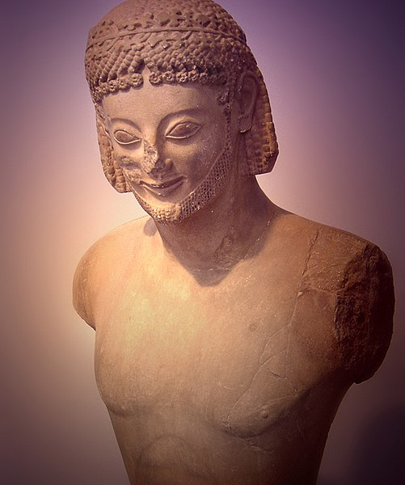
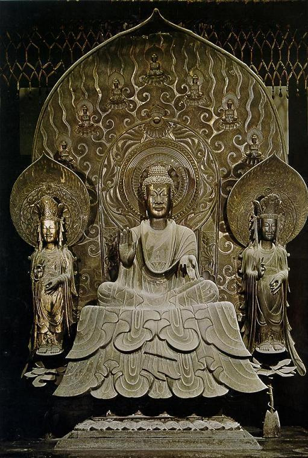
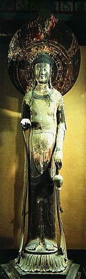

# 飛鳥文化

七世紀前半に蘇我氏や王族によって広められた仏教中心の文化を飛鳥文化といいます。仏教が日本に入り込めた理由について、[律令国家の礎](/ritsuryo-kokka-ishizue)にも書きましたが、もともと自然崇拝というフレキシブルさがあったからでしょう。

法隆寺に行けば、飛鳥文化に影響を与えた中国の南朝様式と北魏様式の両方の仏像を見ることができます。北魏様式は、正面から見ることを前提として、アルカイックスマイルを浮かべています。それに対して南朝様式は、穏やかな顔で全体に丸みがあります。

アルカイック・スマイルは古代ギリシアのアルカイク美術の彫像に見られる表情です。飛鳥文化についても同様の表情が見られます。口元だけが微笑みの形を伴っているのが特徴です。

アルカイックスマイルの例：　クーロスの頭部

出典 Wikipedia

北魏様式:　法隆寺金堂釈迦三尊像

参考 https://ameblo.jp/iyokumamoto/entry-11706442782.html

南朝様式：　法隆寺百済観音像

参考 https://ameblo.jp/iyokumamoto/entry-11706442782.html
