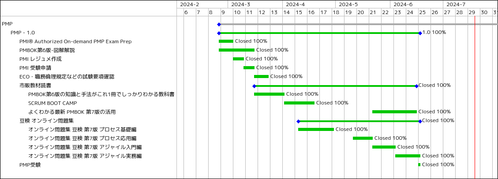

# 4か月でPMP試験合格：学習の流れ、教材選定、計画、試験当日の詳細

2024年6月にPMP試験に合格し、PMPホルダーになりましたので以下に私が取り組んだ学習方法や参考になりそうな情報をまとめました。

デジタル証明書：

* [PMP Certification](https://www.credly.com/badges/c4f3c642-6770-4db0-8bc3-4bbeb4ebd65f/public_url)

## 受験動機

PMPを受験しようと決めたのは、私は本職のプロジェクトマネージャーではありませんが、実際にプロジェクトに関わることが多く、そのフレームワークを体系的に学ぶことで生産性を上げたいと考えたからです。PMP資格を取得することで、プロジェクトの計画、実行、管理においてより効率的かつ効果的な手法を身につけることができると期待しました。

## 準備期間と学習方法

私がPMPの試験準備に費やした期間は約4か月であり、2024年6月に受験を完了しました。4月中旬～5月末の期間は育休中で非常に多忙でしたが、自身で学習計画をしっかり立てて学習を進めました。以下のステップで学習を進めました。

### 教材の選定

PMBOKガイド第7版、アジャイル実務ガイド、プロセスグループ実務ガイドに準じる参考書やオンラインリソースを中心に学習しました。第6版の内容もウォーターフォールについて学習する際に参考にしました。

使用した参考書は以下です：

| 参考書・オンラインリソースなど | 備考 |
| ------------------------------ | ---- |
| [JPSビジネスカレッジ PMP®オンデマンド試験対策コース（35時間）](https://www.jpsol.co.jp/pmp/exam-preparation/on-demand/35h/) | PMP受験資格のための35時間分の公式研修教材。 |
| [I LOVE PM プロジェクトマネジメントチャンネル](https://www.youtube.com/channel/UCFOjnLt9wrDwX7tP3F5hTig) | コミカルな口調で分かりやすく解説してくれる。難解な文章からあたるよりは最初にこのYoutubeチャンネルを見てから学習した方が理解が早いと思います。各再生リストをお気に入りに入れておくと良いです。 |
| [図解即戦力 PMBOK第6版の知識と手法がこれ1冊でしっかりわかる教科書](https://amzn.to/4bLoHZ4) | PMBOK第6版の内容を図解で分かりやすく解説されており参考になります。ただし、第6版はウォーターフォール分野からの出題の参考にはなりますが直接出題されるわけではないです。 |
| [図解即戦力 PMBOK第6版の知識と手法がこれ1冊でしっかりわかる教科書 Youtube再生リスト](https://youtube.com/playlist?list=PLONzfnZffXHk3QvMsvHvkmFKJhcyeVSTu&si=9Ino0_iPEJHpBz-f) | 上記の参考書をYoutubeで著者が解説しています。これだけでは不十分なところがありますが、特に最初はプロジェクトマネジメントの概念的なことを理解するのが難しいので動画教材で分かりやすく解説されているものが理解に役に立ちます。 |
| [PMP Examination Contents Outline](https://www.pmi.org/-/media/pmi/documents/public/pdf/certifications/pmp-examination-content-outline.pdf?v=8ffe0225-6347-4779-913f-f779a38f8d9c&sc_lang_temp=ja-JP) | PMPの試験範囲、試験要綱などがまとまっている公式ドキュメントです。その他職務倫理規定も非常に参考になります。すぐに読める教材の割には試験の参考になる考え方がありますため必読です。 |
| [SCRUM BOOT CAMP THE BOOK【増補改訂版】 スクラムチームではじめるアジャイル開発](https://amzn.to/3Lpun07) | アジャイルフレームワークを実際のプロジェクトに適用してみるというストーリーベースでの解説が分かりやすいです。アジャイルは専門用語が多いのが特徴ですが、この本を1冊読めばアジャイルフレームワークやロールの違い、考え方などについて理解できると思います。 |
| [図解入門 よくわかる 最新 PMBOK第7版の活用 (How-nual Visual Guide Book)](https://amzn.to/3SbFWvk) | PMBOK第7版は原理原則ベースで、あえて抽象的な書き方をしています。このため適用方法やハウツーが難しいのですがその部分を補足的に補うための参考書籍となります。 |
| [豆検 MAMEKEN](https://mameken.com/) | 演習形式で学習できるのが良いです。アジャイル入門編、アジャイル実務編、プロセス基本編、プロセス応用編とありますが、私はすべて行いました。チケットは各コース1か月1000円程度です。総仕上げにはおすすめの教材です。スマホでも学習に取り組めるので、通勤時間などを有効活用したい人にもおすすめです。 |

ちなみに、PMBOK第7版の日本語版を入手するには、PMI Japanの会員になる必要があるのですが私はPMI Japanの会員にはならなかったため入手することはできませんでした。PMBOK第7版英語版については、PMI本部の会員になれば入手可能です。ただし英語版で理解が難しかったため読んでいません。代わりに上記のような参考書やオンラインリソースを用いて学習をしました。英語が得意な方でない限り、ほとんどの人にとってはこのやり方が最も効率的だと思われます。

### 35時間分の研修

PMP資格の受験資格として、35時間分の公式プロジェクトマネジメント教育を受けることが必要です。この教育は、プロジェクトマネジメントの基本的な知識やスキルを学ぶためのものです。

PMP試験の受験者は、時折PMIからの監査を受けることがあります。監査対象となる具体的な割合は発表されていませんが、一般的には全受験者の約1割に満たない程度とされています。これは、監査が全受験者のごく一部に対して行われることを意味します。この監査では、受験資格を満たしていることを証明するために、研修を受講した証拠が必要になります。公式認定の研修を受講することで、監査に対応しやすくなります。

この公式認定のことをPMI認定プロバイダー (ATP: Authorized Training Partner) と言います。

私は、JPSビジネスカレッジというATP教材を受講しました。

* [JPSビジネスカレッジ PMP®オンデマンド試験対策コース（35時間）](https://www.jpsol.co.jp/pmp/exam-preparation/on-demand/35h/)

このコースは演習形式で進められ、最初は正答率が低く苦戦しました。常識で解こうとすると間違えることが多く、PMIイズム（PMIが考える最適な実務慣行や考え方、姿勢）を理解する必要がありました。様々な学習教材を通してPMIイズムを身につけることで、最終的には演習形式での学習が最も効果的であると感じました。

研修の費用は10万円程度と高額でしたが、会社から研修費用として出してもらいました。監査対象になった場合、ATPの研修を受講していた方が確実に通りますので、信頼性が高いです。どうしても出費を抑えたい場合は、Udemyの35時間分研修教材もあります。

* [Udemy: PMP Certification Exam Prep Course](https://ibmcsr.udemy.com/course/pmp-training-for-pmp-certification-pmp-exam/)

### 学習計画の策定

ちょうど育休期間で多忙だったのですが、睡眠不足と格闘しながら学習しました。細切れの時間を有効活用するためにRedmine上で計画立案し実践しました。以下は、その時に使用したRedmineのガントチャートです。

### アジャイル学習

アジャイルプロジェクトの方が経験が多く、アジャイルの専門用語にはすぐに馴染みましたが、用語をしっかりと理解するために「[SCRUM BOOT CAMP](https://amzn.to/3Lpun07)」という本が非常に役立ちました。

あとは、各用語についてインターネットで調べて深く内容を理解していきました。

アジャイルというとスクラムを思い浮かべる人が多いと思うのですが、PMPで出題されるアジャイルはスクラムに限らずさまざまなアジャイルマネジメントについて幅広く出題されます。スクラムについては、[SCRUM BOOT CAMP](https://amzn.to/3Lpun07)を参考にすれば大枠を理解できます。他のアジャイルフレームワークは、豆検のオンライン問題集を活用し学習しました。

### レジュメ作成

受験に際して、英語でのレジュメ作成に苦労しました。ただし、一からすべて自分で書いていったわけではなく、日本語で書かれた職務経歴書をChatGPTに読ませて英語に翻訳して適宜修正していき仕上げました。

監査に通らないようにするには、内容を簡潔にまとめることと、プロジェクトマネージャもしくはそれに準じる役割としてどのようなことを行ったのかということを「PMIの用語を用いて」説明できるとベストです。例えば、単にリーダーシップを発揮してプロジェクトを推進した...とかではなく、チームビルディング、チーム憲章の作成、プロジェクト憲章の作成、WBSの作成、リスクの定性評価、プロジェクトの指揮監督、教訓登録簿への登録などなどが挙げられます。この辺の単語を用いて実際にプロジェクトで行ったことを英語で簡潔に説明しました。

私は監査には通らず、一発で試験の受験資格を獲得しました。

監査プロセスは6日かかりました。監査に引っかかったかなと思いましたが、意外に長い時間を監査プロセスにかけているようでした。

### 総仕上げ

「豆検」のオンライン問題集を活用しました。Peatixでチケットを購入することができ、演習形式で学習を進めました。1コース1か月で1,000円程度と非常にお得で、スマホでも学習できるため、通勤時間を利用して学習しました。

## 試験当日について

試験当日は「PMO西新宿」で受験しました。これまでの学習の成果を信じて臨みました。試験は全体的にバランスよく出題されていた印象です。

ちなみに、PMO西新宿の入り口でインターホンを押して入る形でした。最初分からず困惑しました。

試験当日は開始30分前くらいから受付開始しているので早めに準備しておくと良いと思います。私は朝7時30分に受付だったのですが、遅刻しないように近くのマクドナルドに6時40分くらいから時間を潰していました。会場に着いたらスマホは切る必要があります。軽食は別の袋に入れておけば試験の休憩時間中に食べることができるようですので、コンビニでパンとかサンドイッチを適当に買っていくと良いと思います。