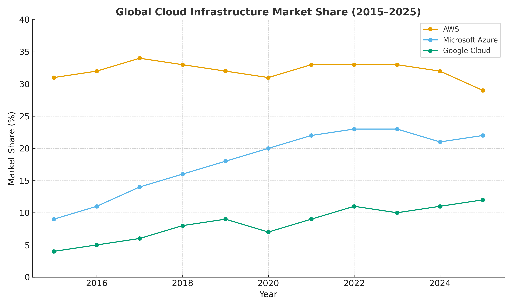

When we talk about the cloud today, three names dominate the conversation: **Amazon Web Services (AWS), Microsoft Azure, and Google Cloud**. But the balance of power has been shifting over the past decade. Looking at the numbers from 2015 to 2025, we can see not only _what_ happened but also _why_ Azure has steadily risen, how AWS has defended its lead, and what this means for the future of cloud.

## Market Share Trends (2015–2025)

The chart below shows how the market shares of AWS, Azure, and Google Cloud have evolved over the past ten years.

_Source: Synergy Research Group, Canalys, Gartner, IDC (2015–2025). Percentages represent global cloud infrastructure services revenue._

## From Dominance to Duopoly

In **2015**, AWS towered over the market with more than **30% share**, while Azure was in the single digits and Google Cloud barely registered. Fast forward to **2025**, and the picture looks very different:

- **AWS**: down to \~29% share, still the leader but no longer expanding its lead
- **Azure**: up to \~22%, consistently narrowing the gap
- **Google Cloud**: \~12%, a respectable but distant third

The shift isn’t about AWS collapsing — in fact, AWS’s revenues grew massively. The key is that **Azure grew faster**, consistently outpacing the overall market as enterprises embraced Microsoft’s hybrid cloud strategy and integrated ecosystem.

## Why Azure Caught Up

Three forces explain Azure’s rise:

1. **Enterprise foothold**
   Microsoft leveraged decades of enterprise relationships — Office, Windows Server, SQL Server — to bundle Azure into existing contracts. CIOs found it easier to extend into Azure than to start fresh with AWS.

2. **Hybrid & compliance edge**
   Unlike AWS, which pushed for an all-in cloud model, Microsoft leaned into **hybrid deployments**. That positioned Azure as the safer choice for regulated industries (finance, government, healthcare) where on-prem integration was non-negotiable.

3. **AI acceleration**
   In recent years, Microsoft’s massive bets on **AI infrastructure and OpenAI partnership** turned Azure into the go-to platform for generative AI workloads. This drove incremental share gains in 2023–2025 as enterprises raced to adopt AI.

## How AWS Held the Line

If Azure has been gaining, why hasn’t AWS lost more? Because AWS has remained a **growth engine in absolute terms**. The market itself exploded — from \~\$20B in 2015 to nearly \~\$300B+ by 2025 — and AWS scaled right alongside it. Even with a flat or slightly declining share, AWS still adds more revenue every year than many competitors generate in total.

AWS’s strategy has been to **expand breadth**: thousands of services, global infrastructure, and relentless innovation in compute, storage, and networking. This ensured that while Azure gained ground, AWS’s dominance didn’t erode the way some predicted.

## Google Cloud: The Steady Climber

Google Cloud’s story is different. Long lagging behind, it found traction in **data analytics, AI, and multi-cloud openness**. While still far smaller than AWS or Azure, its rise from low single digits to double digits shows that the “big three” dynamic is stable: AWS, Azure, Google now account for over **60% of global cloud spend**.

## The Essence of the Trend

The **essence of the past decade** is not AWS falling, but Azure’s relentless rise into a true **duopoly**. In 2015, AWS had more than triple Azure’s share; today, it’s closer to a 29% vs. 22% split. The battle is no longer about _if_ Azure can challenge AWS, but _how much further it can close the gap_.

- **AWS = breadth + first-mover advantage**
- **Azure = enterprise integration + hybrid strategy + AI momentum**
- **Google = data/AI niche, consistent but smaller scale**

## Looking Ahead

Going into the next few years, the story will hinge on **AI-driven demand** and **enterprise modernization**. Azure is well-positioned, but AWS’s scale means it will remain formidable. Google Cloud could benefit disproportionately if AI workloads tilt toward its strengths.

The takeaway: the cloud market has matured into a **three-horse race**, but the real rivalry is between AWS and Azure — a duopoly that defines how digital infrastructure evolves worldwide.
