# FEKスタック構築手順

## 1. 概要

FEKスタック（Fluentd, Elasticsearch, Kibana）は、システムやアプリケーションのログを収集、保存、そして可視化するための強力なツールセットです。この手順書では、FEKスタックを効率的にインストールし、設定するための手順を詳細に説明します。

Fluentdは多様なデータソースからのログ収集を担当し、Elasticsearchはそのログを構造化して保存します。最後に、Kibanaを使用してログデータを視覚的に分析し、必要な情報を迅速に抽出できるダッシュボードを構築します。

本手順書では、システム設定からソフトウェアのインストール、設定、さらにはOCIオブジェクトストレージへのログの転送および管理まで、全体の流れを網羅しています。

## 2. 前提条件

FEKスタックの構築にあたり、以下の前提条件を満たしている必要があります。

### 2.1 対応OS
- CentOS, RHEL などのRedHat系Linuxディストリビューション

### 2.2 権限
- root権限またはそれに準じる管理者権限が必要です。

### 2.3 ネットワーク設定
- インターネットアクセスが可能であること（必要なパッケージのインストールやリポジトリの追加にインターネット接続が必要）。

### 2.4 ソフトウェアバージョン
- Elasticsearch: 8.x 系
- Fluentd: td-agent 3.x 系
- Kibana: 8.x 系

### 2.5 事前準備
- ファイアウォールやセキュリティグループで必要なポートが開放されていること（例: Elasticsearchの9200ポート、Kibanaの5601ポート）。
- サーバーの時刻が正確であること（時刻同期設定が必要）。

### 2.6 その他
- 本手順書に従う前に、システムのバックアップを取得しておくことを推奨します。

## 3. システム設定

FEKスタックを構築する前に必要なシステム設定について説明します。これらの設定により、Fluentd、Elasticsearch、Kibanaが適切に動作するための基盤を整えます。

### 3.1 ファイルディスクリプタの制限緩和

Fluentdは多くのファイルやネットワーク接続を扱うため、システムが同時に開くことができるファイルディスクリプタの上限を適切に設定する必要があります。

1. `/etc/security/limits.conf`ファイルに以下の設定を追加します。

```bash
sudo vim /etc/security/limits.conf

root soft nofile 65536
root hard nofile 65536
* soft nofile 65536
* hard nofile 65536
```

2. 設定を反映させるためにマシンを再起動します。

```bash
sudo systemctl reboot
```

3. 再起動後、`ulimit -n`コマンドで設定が反映されていることを確認する。

```bash
ulimit -n
65536
```

### 3.2 ネットワークカーネルパラメータの最適化

高負荷環境での安定動作を確保するため、ネットワークカーネルパラメータを最適化します。

1. `/etc/sysctl.conf`ファイルに以下の設定を追加する。

```bash
net.core.somaxconn = 1024
net.core.netdev_max_backlog = 5000
net.core.rmem_max = 16777216
net.core.wmem_max = 16777216
net.ipv4.tcp_wmem = 4096 12582912 16777216
net.ipv4.tcp_rmem = 4096 12582912 16777216
net.ipv4.tcp_max_syn_backlog = 8096
net.ipv4.tcp_slow_start_after_idle = 0
net.ipv4.tcp_tw_reuse = 1
net.ipv4.ip_local_port_range = 10240 65535
net.ipv4.ip_local_reserved_ports = 24224
```

2. 設定を適用する。

```bash
sudo sysctl -p
```

### 3.3 時刻同期設定

システムの時刻が正確であることは、ログ管理において非常に重要です。時刻同期を正しく設定します。

1. `systemd-timesyncd`をインストールします。

```bash
sudo dnf install systemd-timesyncd
```

2. `/etc/systemd/timesyncd.conf`ファイルを編集し、NTPサーバーを設定します。

```bash
sudo vim /etc/systemd/timesyncd.conf

[Time]
NTP=ntp.nict.jp
```

3. サービスを有効化し、即時起動します。

```bash
sudo systemctl enable --now systemd-timesyncd.service
```

## 4. ソフトウェアのインストール

FEKスタック（Fluentd、Elasticsearch、Kibana）の各コンポーネントをインストールする手順について説明します。これにより、ログ収集、保存、可視化のための基本的な基盤を構築します。

### 4.1 Fluentdのインストール

1. `EPEL`レポジトリのインストール

EPEL (Extra Packages for Enterprise Linux) は、RedHat系ディストリビューション向けの追加パッケージリポジトリです。Fluentdをインストールするために必要な依存パッケージを提供します。

```bash
sudo dnf install epel-release -y
```

2. td-agentのインストール

td-agentは、Fluentdの公式バイナリパッケージで、RedHat系システムでFluentdを簡単にインストールできるようにしたものです。

```bash
curl -L https://toolbelt.treasuredata.com/sh/install-redhat-td-agent4.sh | sh
```

3. サービス実行ユーザの変更

こちらのステップは場合によっては不要ですが、ログの権限によっては特権ユーザでのFluentdサービス実行が必須の場合があり、そのような場合には以下を設定します。

td-agentのサービスファイルを編集します。

```bash
sudo vim /usr/lib/systemd/system/td-agent.service
```

ユーザーとグループの設定をコメントアウトします。

```bash
[Unit]
Description=td-agent: Fluentd based data collector for Treasure Data
Documentation=https://docs.treasuredata.com/display/public/PD/About+Treasure+Data%%27s+Server-Side+Agent
After=network-online.target
Wants=network-online.target

[Service]
# User=td-agent
# Group=td-agent
LimitNOFILE=65536
Environment=LD_PRELOAD=/opt/td-agent/lib/libjemalloc.so
Environment=GEM_HOME=/opt/td-agent/lib/ruby/gems/3.1.0/
Environment=GEM_PATH=/opt/td-agent/lib/ruby/gems/3.1.0/
Environment=FLUENT_CONF=/etc/td-agent/td-agent.conf
Environment=FLUENT_PLUGIN=/etc/td-agent/plugin
Environment=FLUENT_SOCKET=/var/run/td-agent/td-agent.sock
Environment=TD_AGENT_LOG_FILE=/var/log/td-agent/td-agent.log
EnvironmentFile=-/etc/sysconfig/td-agent
PIDFile=/var/run/td-agent/td-agent.pid
RuntimeDirectory=td-agent
Type=forking
# XXX: Fix fluentd executables path
ExecStart=/opt/td-agent/bin/fluentd --log $TD_AGENT_LOG_FILE --daemon /var/run/td-agent/td-agent.pid $TD_AGENT_OPTIONS
ExecStop=/bin/kill -TERM ${MAINPID}
ExecReload=/bin/kill -HUP ${MAINPID}
Restart=always
TimeoutStopSec=120

[Install]
WantedBy=multi-user.target
```

サービス設定ファイルを反映させます。

```bash
sudo systemctl daemon-reload
```

4. td-agentの起動と有効化

インストール後、td-agentサービスを起動し、システム起動時に自動的に開始されるように設定します。

```bash
sudo systemctl enable --now td-agent.service
```

### 4.2 Elasticsearchのインストール

1. ElasticsearchのGPGキーをインポート

Elasticsearchのパッケージをインストールするために、まずGPGキーをインポートします。

```bash
sudo rpm --import https://artifacts.elastic.co/GPG-KEY-elasticsearch
```

2. Elasticsearchリポジトリの追加

Elasticsearchのパッケージを取得するためのリポジトリを追加します。

```bash
sudo tee /etc/yum.repos.d/elasticsearch.repo <<EOF
[elasticsearch]
name=Elasticsearch repository for 8.x packages
baseurl=https://artifacts.elastic.co/packages/8.x/yum
gpgcheck=1
gpgkey=https://artifacts.elastic.co/GPG-KEY-elasticsearch
enabled=1
autorefresh=1
type=rpm-md
EOF
```

3. Elasticsearchのインストール

Elasticsearchをインストールします。

```bash
sudo dnf install --enablerepo=elasticsearch elasticsearch -y
```

4. Elasticsearchの起動と有効化

インストール後、Elasticsearchサービスを起動し、システム起動時に自動的に開始されるように設定します。

```bash
sudo systemctl enable --now elasticsearch.service
```

### 4.3 Kibanaのインストール

1. Kibanaのインストール

KibanaはElasticsearchリポジトリから直接インストールできます。

```bash
sudo dnf install kibana -y
```

2. Kibanaの起動と有効化

インストール後、Kibanaサービスを起動し、システム起動時に自動的に開始されるように設定します。

```bash
sudo systemctl enable --now kibana.service
```

## 5. Fluentdの設定

Fluentdを設定して、ログを収集し、Elasticsearchに送信する方法を説明します。Fluentdの設定ファイルを適切に構成することで、効率的なログ管理が可能になります。

### 5.1 設定ファイルのバックアップ

まず、Fluentdの設定ファイルを編集する前に、既存の設定ファイルをバックアップします。

```bash
sudo cp /etc/td-agent/td-agent.conf /etc/td-agent/td-agent.conf.bk
```

### 5.2 Fluentdの設定ファイルを編集

以下の手順で、ログの収集とElasticsearchへの送信を設定します。

1. `/etc/td-agent/conf.d/`ディレクトリの作成とインクルード

既存の設定ファイル（`/etc/td-agent/td-agent.conf`）を汚さず、また複数の設定ファイルで柔軟に構成できるよう、`/etc/td-agent/conf.d/`ディレクトリを作成し、その下に設定ファイルを追加します。

```bash
sudo mkdir -p /etc/td-agent/conf.d/
```

設定ファイルをインクルードする設定を`/etc/td-agent/td-agent.conf`に追加します。

```bash
sudo vim /etc/td-agent/td-agent.conf

# Include config files in the conf.d directory
@include conf.d/*.conf
```

`@include`ディレクトリについての参考：

* [Config File Syntax | Fluentd](https://docs.fluentd.org/configuration/config-file)

今回は、ログファイル`/var/log/messages`の転送を行うため、これに対応する`/etc/td-agent/conf.d/messages.conf`としました。

```bash
sudo vim /etc/td-agent/conf.d/messages.conf
```

以後このファイルに対して追記を行います。

2. ログソースの定義

収集するログのソースを定義します。以下の例では、`/var/log/messages`のログを収集対象としています。

```
<source>
  @type tail
  path /var/log/messages
  pos_file /var/log/td-agent/messages.pos
  tag messages
  format none
</source>
```

3. レコードの変換

収集したログにホスト名を付加するためのレコード変換フィルタを設定します。

```
<filter **>
  @type record_transformer
  <record>
    hostname ${hostname}
  </record>
</filter>
```

4. ログの転送先設定（Elasticsearh）

収集したログをElasticsearchに送信します。以下の設定例では、`messages`インデックスにログを送信します。

```
<match messages>
  @type elasticsearch
  host localhost
  port 9200
  type_name log
  include_tag_key true
  logstash_prefix messages
  logstash_format true
</match>
```

### 5.3 td-agentの再起動

設定ファイルの編集が完了したら、設定テストの後、td-agentを再起動して設定を反映させます。

```bash
sudo td-agent --dry-run
sudo systemctl restart td-agent.service
```

## 6. Elasticsearchの設定

Elasticsearchの基本的な設定を行い、Fluentdから送信されたログを受信・保存できるようにします。

### 6.1 セキュリティ設定の無効化

開発環境やテスト環境では、Elasticsearchのセキュリティ機能を無効にして簡易的な設定で運用することが一般的です。以下の設定でTLSやセキュリティ関連の機能を無効化します。

1. Elasticsearchの設定ファイル（`/etc/elasticsearch/elasticsearch.yml`）を編集します。

以下の設定を追加または変更します。

```
# Enable security features
xpack.security.enabled: false

xpack.security.enrollment.enabled: false

# Enable encryption for HTTP API client connections, such as Kibana, Logstash, and Agents
xpack.security.http.ssl:
  enabled: false
  keystore.path: certs/http.p12

# Enable encryption and mutual authentication between cluster nodes
xpack.security.transport.ssl:
  enabled: false
  verification_mode: certificate
  keystore.path: certs/transport.p12
  truststore.path: certs/transport.p12
```

### 6.2 Elasticsearchの再起動

設定を反映させるために、Elasticsearchを再起動します。

```bash
sudo systemctl restart elasticsearch.service
```

### 6.3 Elasticsearchのステータス確認

再起動後、Elasticsearchが正常に動作しているかを確認します。以下のコマンドを使用して、クラスタのヘルスステータスを確認できます。

```bash
curl -X GET "localhost:9200/_cluster/health?pretty"
```

出力例：

```json
{
  "cluster_name" : "elasticsearch",
  "status" : "green",
  "timed_out" : false,
  "number_of_nodes" : 1,
  "number_of_data_nodes" : 1,
  "active_primary_shards" : 5,
  "active_shards" : 5,
  "relocating_shards" : 0,
  "initializing_shards" : 0,
  "unassigned_shards" : 0,
  "delayed_unassigned_shards" : 0,
  "number_of_pending_tasks" : 0,
  "number_of_in_flight_fetch" : 0,
  "task_max_waiting_in_queue_millis" : 0,
  "active_shards_percent_as_number" : 100.0
}
```

この出力で`status`が`green`であれば、Elasticsearchは正常に動作しています。

## 7. Kibanaの設定

Kibanaの基本的な設定を行い、Elasticsearchに接続してデータを可視化する準備を整えます。KibanaはElasticsearchのデータを視覚的に分析するためのツールであり、その設定を適切に行うことで、効率的なデータ探索が可能になります。

### 7.1 Kibanaの設定ファイルを編集

KibanaをElasticsearchに接続するために、設定ファイル（`/etc/kibana/kibana.yml`）を編集します。

Kibanaがリッスンするポートとホスト、Elasticsearchへの接続設定を行います。以下の設定を追加または変更します。

```
server.port: 5601
server.host: "0.0.0.0"  # Kibanaを外部からアクセス可能にする場合は "0.0.0.0" を使用
elasticsearch.hosts: ["http://localhost:9200"]  # Elasticsearchがローカルホスト上で動作している場合
```

### 7.2 Kibanaの再起動

設定ファイルを保存した後、Kibanaサービスを再起動して設定を反映させます。

```bash
sudo systemctl restart kibana.service
```

### 7.3 Kibanaのステータス確認

Kibanaが正常に起動しているかを確認します。以下のコマンドを使用して、Kibanaサービスのステータスを確認できます。

```bash
sudo systemctl status kibana.service
```

## 8. Kibanaのログインと初期設定

Kibanaにログインし、基本的な初期設定を行う手順を説明します。これにより、Elasticsearchに保存されたデータをKibanaで可視化し、分析できるようになります。

### 8.1 Kibanaへのログイン

1. ブラウザでKibanaにアクセス

Kibanaはウェブベースのインターフェースを提供します。以下のURLをブラウザで開きます：

```
http://<KibanaサーバーのIP>:5601
```

2. 初回ログイン

Kibanaの初回ログイン時に、ElasticsearchのEnrollment Token（登録トークン）を求められる場合があります。これはElasticsearchのノード上で生成できます。

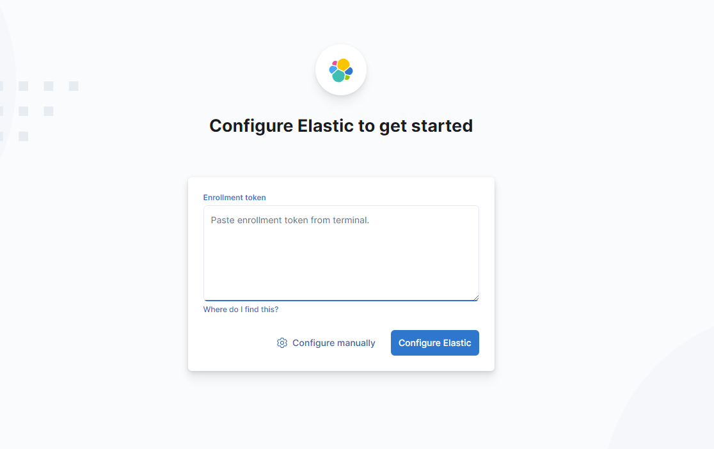

Enrollment Tokenを取得するには、Elasticsearchノードで以下のコマンドを実行します：

```bash
sudo /usr/share/elasticsearch/bin/elasticsearch-create-enrollment-token -s kibana
```

生成されたトークンをコピーし、Kibanaの画面に貼り付けて登録します。

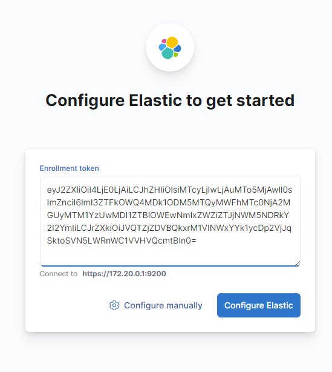

3. 検証コードの確認

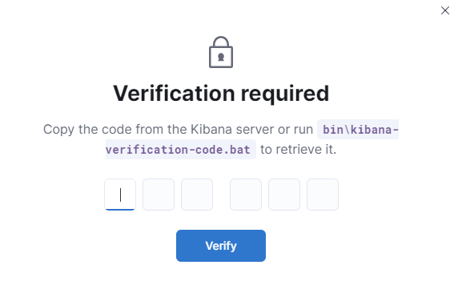

検証コードの入力を求められた場合、次のコマンドで確認します：

```bash
sudo /usr/share/kibana/bin/kibana-verification-code
Your verification code is:  297 245
```

これにより、Kibanaへの登録が完了し、ダッシュボードにアクセスできるようになります。

### 8.2 初期ユーザーとパスワードの設定

1. 初期ユーザーのパスワードリセット

初期ユーザー（`elastic`ユーザー）のパスワードをリセットする必要がある場合、次のコマンドを使用します：

```bash
sudo /usr/share/elasticsearch/bin/elasticsearch-reset-password -u elastic

This tool will reset the password of the [elastic] user to an autogenerated value.
The password will be printed in the console.
Please confirm that you would like to continue [y/N]y


Password for the [elastic] user successfully reset.
New value: x12jdt0IMA*cjKCLUau*
```

自動生成されたパスワードが表示されるので、これを使用してログインします。

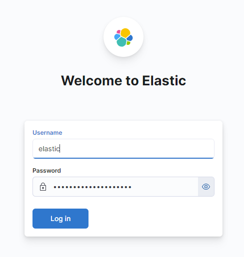

### 8.3 Kibanaの初期設定

1. ダッシュボード設定

ログイン後、Kibanaのダッシュボードに移動します。初回ログイン時には、インデックスパターンの設定が必要です。

左ペインの「Management」→「Stack Management」→「Kibana」→「Data Views」を選択し、新しいデータビュー（インデックスパターン）を作成します。

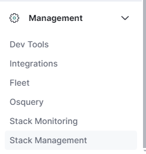

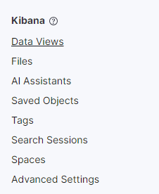

2. インデックスパターンの設定

データビュー名に`messages-*`のように、Fluentdから送信されたログのインデックスパターンを指定します。

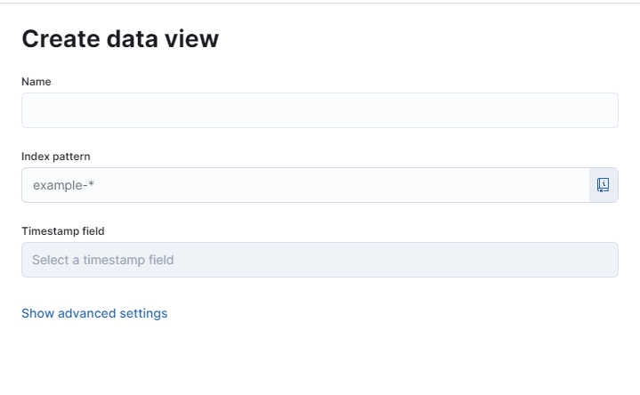

3. Discoverでログの確認

Kibanaの「Discover」機能を使用して、Elasticsearchに保存されたログデータを確認できます。これにより、ログの可視化やクエリの作成が可能になります。


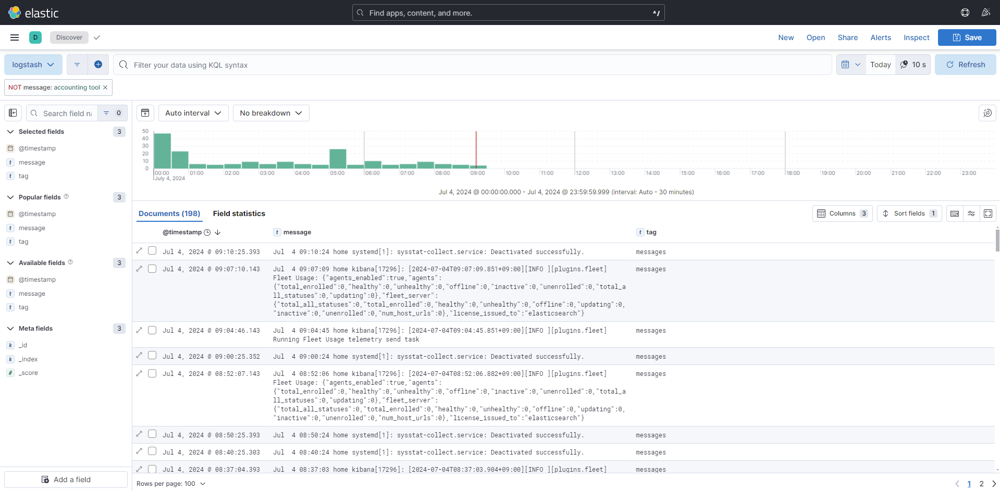

KQLについては、ドキュメントを参照してください。

https://www.elastic.co/guide/en/kibana/current/discover.html

## 9. ログの保管および転送設定

Fluentdで収集したログの保管方法や転送先の設定について説明します。ログの適切な保管や転送設定により、長期的なデータの保持と必要な情報の効率的な取り出しが可能になります。

### 9.1 インデックスのライフサイクルポリシー設定

Elasticsearchに保存されたログデータは、インデックスライフサイクル管理 (ILM) を使用して、データの自動管理を行うことができます。ILMを使用することで、データの保管期間を自動的に管理し、不要になったデータを削除することが可能です。

1. ライフサイクルポリシーの定義

ElasticsearchのDev Toolsを使用して、インデックスのライフサイクルポリシーを定義します。以下の例では、データを180日間保管した後に削除するポリシーを定義しています。

```json
PUT _ilm/policy/my_policy
{
  "policy": {
    "phases": {
      "delete": {
        "min_age": "180d",
        "actions": {
          "delete": {}
        }
      }
    }
  }
}
```

2. インデックステンプレートの作成

新しく作成されるインデックスに対してライフサイクルポリシーを適用するために、インデックステンプレートを作成します。以下の設定では、`messages-*`というパターンにマッチするインデックスに対してライフサイクルポリシーが適用されます。

```json
PUT _index_template/messages_template
{
  "index_patterns": ["messages-*"],
  "template": {
    "settings": {
      "number_of_shards": 1,
      "number_of_replicas": 1,
      "index.lifecycle.name": "my_policy",
      "index.lifecycle.rollover_alias": "messages"
    }
  }
}
```

3. 既存インデックスの整理

検証やテストで使用した古いインデックスを削除し、新しいポリシーに基づいてインデックスが管理されるようにします。

```
DELETE messages-*
```

### 9.2 OCIオブジェクトストレージへのログ転送設定

OCI（Oracle Cloud Infrastructure）のオブジェクトストレージにログを転送することで、長期的なログの保管とバックアップを行います。Fluentdを使用して、OCIオブジェクトストレージにログを転送するための設定手順を以下に説明します。

#### 9.2.1 OCIの設定

まず、OCI側で必要な設定を行います。これには、ユーザーの認証情報の取得とオブジェクトストレージの設定が含まれます。

1. Customer Secret Keyの生成

OCIコンソールにログインし、ユーザー詳細ページからCustomer Secret Keyを生成します。

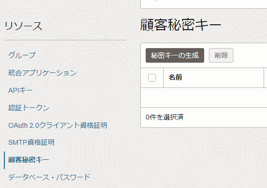

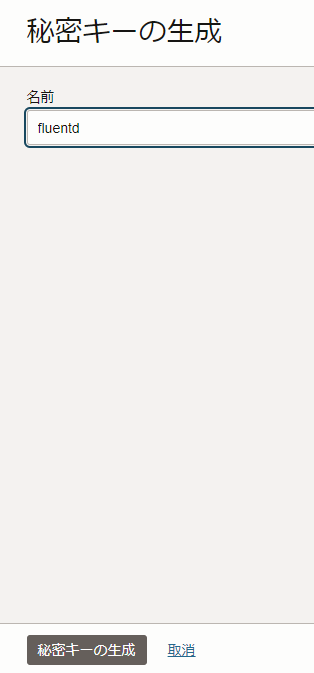

生成されたSecret KeyとAccess Keyを控えておきます。Secret Keyは、「生成されたキー」から、Access Keyは画面を戻した先の「アクセス・キー」から確認できます。


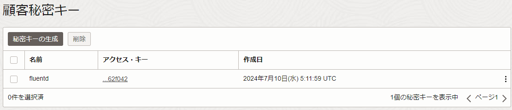

* Secret Key例：`+Hpy1c5rG+Eub+DrBHDAVTw7k1W3Vs1Hziu3MdDzoSM=`
* Access Key例：`f969a8c69d321afd5f1e0eag9953d9e6b962f042`

#### 9.2.2 Fluentdの設定

次に、Fluentdの設定を行い、OCIオブジェクトストレージへのログ転送を設定します。

1. プラグインのインストール

OCIはS3互換 APIを提供しているため、fluentdでAWS S3用のプラグインを使ってOCIオブジェクト・ストレージにログをアップロードすることができます。

```bash
$ sudo td-agent-gem install fluent-plugin-s3
```

2. Fluentdの設定ファイルを編集

`/etc/td-agent/td-agent.conf`ファイルを編集し、OCIオブジェクトストレージへのログ転送設定を追加します。

`YOUR_OCI_USER_OCID`、`YOUR_OCI_AUTH_TOKEN`、`YOUR_BUCKET_NAME`には、それぞれ取得したOCID、生成したトークン、OCI上のオブジェクトストレージのバケット名を設定します。

`s3_region`と`s3_endpoint`はOCIのリージョンやバケットのエンドポイントを設定します。

```
<source>
  @type tail
  path /var/log/messages
  pos_file /var/log/td-agent/messages.pos
  tag messages
  format none
</source>

<filter **>
  @type record_transformer
  <record>
    hostname ${hostname}
  </record>
</filter>

<match messages>
  @type copy
  <store>
    @type elasticsearch
    host localhost
    port 9200
    type_name log
    include_tag_key true
    logstash_prefix messages
    logstash_format true
  </store>
  <store>
    @type s3
    aws_key_id "YOUR_OCI_USER_OCID"
    aws_sec_key "YOUR_OCI_AUTH_TOKEN"
    s3_bucket "YOUR_BUCKET_NAME"
    s3_region "us-phoenix-1"
    s3_endpoint "https://<namespace>.compat.objectstorage.<region>.oraclecloud.com"
    check_apikey_on_start false
    ssl_verify_peer false
    force_path_style true
    path %Y/%m/%d/bastion/messages.log
    <buffer>
      @type file
      path /var/log/td-agent/buffer/messages.buffer
      timekey 1d
      timekey_wait 10m
      queue_limit_length 256
      flush_at_shutdown true
      flush_interval 1s
      retry_wait 30s
      retry_max_times 9
    </buffer>
  </store>
</match>
```

3. Fluentdの再起動

設定が完了したら、Fluentdサービスを再起動して変更を反映させます。

```bash
sudo systemctl restart td-agent.service
```

### 9.3 OCIオブジェクトストレージにおけるライフサイクルポリシー設定

OCIオブジェクトストレージに保存されるログファイルのライフサイクルを管理するために、ライフサイクルポリシーを設定します。これにより、指定した日数が経過したログファイルを自動的にアーカイブまたは削除することができます。

#### 9.3.1 IAMポリシーの設定

まず、OCIオブジェクトストレージに対してライフサイクルポリシーを適用するために必要なIAMポリシーを設定します。

1. IAMポリシー・ステートメントの追加

OCIコンソールで、対象のコンパートメントに対して以下のIAMポリシーを追加します。

ポリシー例：

```
Allow service objectstorage-ap-tokyo-1 to manage object-family in compartment <コンパートメント名>
```

このポリシーにより、オブジェクトストレージ内のオブジェクトファミリー（バケットやオブジェクト）を管理する権限が付与されます。

#### 9.3.2 ライフサイクルポリシーの設定

次に、対象のバケットに対してライフサイクルポリシーを設定します。

1. バケットの選択

OCIコンソールのオブジェクトストレージページに移動し、対象のバケットを選択します。

2. ライフサイクルポリシールールの設定

「ライフサイクル・ポリシー・ルール」セクションで、新しいルールを追加します。

以下は、一般的なライフサイクルポリシーの例です：
* アーカイブ・ルール（archive-lifecycle-rule）: ログファイルを180日後にアーカイブに移動。
* 削除・ルール（delete-lifecycle-rule）: ログファイルを1,095日後（約3年）に削除。


3. ポリシーの適用

ルールの設定が完了したら、「保存」をクリックしてライフサイクルポリシーをバケットに適用します。

## 10. Kibanaでのログ可視化とアラート発砲

KibanaはElasticsearchに保存されたデータを可視化するための強力なツールです。ログデータを視覚的に分析し、インサイトを得るために、Kibanaを使ってダッシュボードを作成したり、クエリを実行したりする方法について説明します。

### 10.1 データビュー（インデックスパターン）の作成

まず、KibanaでElasticsearchのデータを可視化するために、インデックスパターン（データビュー）を作成します。

1. データビューの作成

Kibanaの左ペインから「Management」→「Stack Management」→「Kibana」→「Data Views」を選択します。

「Create Data View」ボタンをクリックし、新しいインデックスパターンを作成します。

2. インデックスパターンの指定

データビュー名には、FluentdからElasticsearchに送信されたログのインデックスパターンを指定します。例えば、`messages-*`のようにワイルドカードを使用して複数のインデックスをまとめて指定できます。

「Time filter field name」には、タイムスタンプが記録されているフィールド（通常は`@timestamp`）を指定します。

3. データビューの保存

設定が完了したら「Create Data View」ボタンをクリックしてデータビューを保存します。

### 10.2 Discoverでログの検索とフィルタリング

作成したデータビューを使用して、Elasticsearchに保存されたログをKibanaの「Discover」機能で検索、フィルタリングします。

1. Discoverの使用

Kibanaの左ペインから「Discover」を選択します。作成したデータビュー（例: `messages-*`）を選択します。

2. クエリの実行

KQL (Kibana Query Language) を使用して、ログデータをフィルタリングできます。例えば、特定のホストからのログを検索する場合は、`hostname: "your-hostname"`のようなクエリを実行します。時間範囲を指定して、特定の期間内のログのみを表示することも可能です。

3. フィールドのカスタマイズ

Discoverビューでは、表示するフィールドをカスタマイズできます。右側のフィールドリストから必要なフィールドを選択し、ドラッグ＆ドロップで表示を調整します。

### 10.3 ダッシュボードの作成

Kibanaのダッシュボード機能を使用して、複数のビジュアライゼーションを一つの画面にまとめ、リアルタイムでデータをモニタリングできるようにします。

1. ダッシュボードの作成

Kibanaの左ペインから「Dashboard」を選択し、「Create Dashboard」ボタンをクリックします。

2. ビジュアライゼーションの追加

ダッシュボードに追加するビジュアライゼーションを作成します。たとえば、「Visualize Library」から新しいビジュアライゼーションを作成し、折れ線グラフ、棒グラフ、円グラフなどでログデータを視覚化します。

既存のビジュアライゼーションがある場合、それらをダッシュボードに追加できます。

3. ダッシュボードの保存

作成したダッシュボードは、名前を付けて保存し、必要に応じていつでもアクセスできるようにします。保存後、ダッシュボードはKibanaの「Dashboard」メニューからいつでも閲覧可能です。

## 11. アラート設定

Kibanaを使用して、特定の条件に基づいてアラートを設定し、ログデータに異常や特定のパターンが検出された際に通知を受けることができます。ここでは、Kibanaでアラートを設定するための手順を説明します。

アラート機能を有効にするためには、KibanaとElasticsearchにいくつかの設定を追加する必要があります。

### 11.1 前提設定

#### 11.1.1 Kibanaの設定変更

まず、Kibana用のシステムユーザのパスワードを設定します。

下のパスワードは任意に設定してください。

```json
curl -u elastic:your_elastic_password -X POST "localhost:9200/_security/user/kibana_system/_password" -H "Content-Type: application/json" -d '{
  "password" : "your_kibana_system_password"
}'
```

また、設定ファイルに追加するための32ビット暗号化キーをOpenSSLを使用して生成します。

```bash
sudo openssl rand -base64 32
```

Kibanaの設定ファイル（`/etc/kibana/kibana.yml`）を編集します。

```
xpack.encryptedSavedObjects.encryptionKey: "生成した32バイトのキー"

elasticsearch.username: "kibana_system"
elasticsearch.password: "your_kibana_system_password"
```

以下の設定をコメントアウトします。

```
# elasticsearch.serviceAccountToken: "your_service_account_token"
```

#### 11.1.2 Elasticsearchの設定変更

Elasticsearchの設定ファイルを編集し、セキュリティ機能を有効にします。

```bash
sudo vim /etc/elasticsearch/elasticsearch.yml

xpack.security.enabled: false
-> 
xpack.security.enabled: true
```

#### 11.1.3 td-agentの設定変更

td-agentの設定ファイル（`/etc/td-agent/td-agent.yml`）を編集し、Elasticsearchに接続するための認証情報を追加します。

```
<match messages>
  @type copy
  <store>
    @type elasticsearch
    host localhost
    port 9200
    user elastic
    password x12jdt0IMA*cjKCLUau*
    type_name log
    include_tag_key true
    logstash_prefix messages
    logstash_format true
  </store>
</match>
```

#### 11.1.4 FEKスタックの再起動

全ての設定が完了したら、以下のコマンドでFEKスタックを再起動する。

```bash
sudo systemctl restart td-agent elasticsearch kibana
```

問題が発生した場合は、各サービスのログを確認してトラブルシューティングを行う。

```bash
sudo tail -f /var/log/td-agent/td-agent.log
sudo tail -f /var/log/elasticsearch/elasticsearch.log
sudo tail -f /var/log/kibana/kibana.log
```

### 11.2 アラート条件の作成

Kibanaで特定の条件に基づいてアラートを設定します。ここでは、ログデータに特定のメッセージが含まれている場合にアラートを発動する例を示します。

1. Discoverからアラートを作成

Kibanaの左ペインから「Discover」を選択し、ログデータを表示します。


2. アラート作成

「Alert」をクリックし、次に「Create search threthold rule」を選択します。

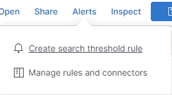

3. ルール設定

例えば以下のように設定します。

* Name: test-alert
* tag: test
* Define your query: message: "This is a test message*"
* WHEN: count
* OVER all documents
* IS ABOVE 1
* FOR THE LAST 5 minutes

Set the number of documents to send
* SIZE 1

Actions

* Server Log
* Action Frequency: For each Alert On Status Changed
* Run when: Query matched
* If alert matches a query: kibana.alert.rule.name: test-alert
* Level: Error
* Message

```
Elasticsearch query rule '{{rule.name}}' is active:

- Value: {{context.value}}
- Conditions Met: {{context.conditions}} over {{rule.params.timeWindowSize}}{{rule.params.timeWindowUnit}}
- Timestamp: {{context.date}}
- Link: {{context.link}}
```

として、「Add action」をクリックします。

最後に、「save」をクリックします。

4. アラートの保存とテスト

Discover画面に戻り、アラート動作のテストを行います。再度「Alerts」をクリックし、「Manage rules and connectors」をクリックします。

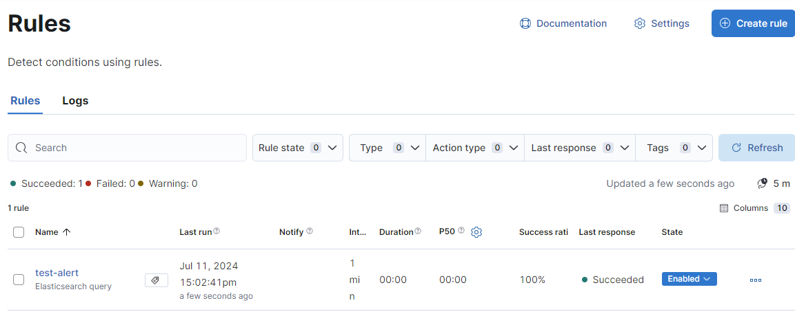

作成した、「test-alert」をクリックします。

ノードにログインし、次のコマンドを叩きます。

```bash
sudo logger "This is a test message for /var/log/messages"
```

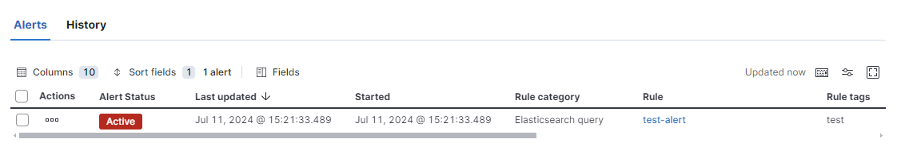

アラート条件に合致したものを一覧することができました。アラートを確認すると、ステータスが「Recovered」に変わります。

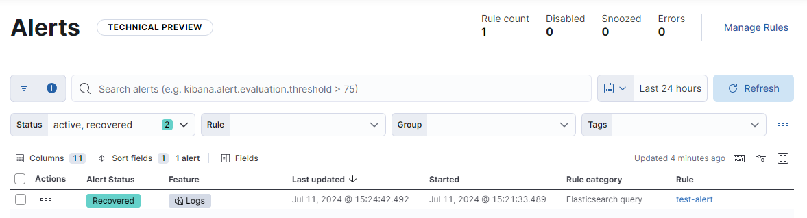

## 12. NginxによるリバースプロキシとSSL/TLS Termination

Kibanaに対してNginxをリバースプロキシとして設定し、SSL/TLS証明書を使用して安全な接続を提供する手順を説明します。

### 12.1 CertbotによるSSL証明書の取得

Certbotを使用してSSL証明書を取得します。

```bash
sudo certbot certonly --standalone --agree-tos -m taro@example.com -d www.example.com
```

### 12.2 以前の証明書設定の削除

古い証明書関連の設定を削除します。

```bash
sudo rm -rf /etc/letsencrypt/live/your-old-domain.example.com/
sudo rm -rf /etc/letsencrypt/archive/your-old-domain.example.com/
sudo rm /etc/letsencrypt/renewal/your-old-domain.example.com.conf
```

### 12.3 Nginxのインストールと設定

Nginxをインストールします。

```bash
sudo dnf install nginx -y
```

Nginxの設定ファイル`/etc/nginx/conf.d/kibana.conf`を編集し、以下の設定を追加します。

```
server {
    listen 8443 ssl;
    server_name www.example.com;

    ssl_certificate /etc/letsencrypt/live/www.example.com/fullchain.pem;
    ssl_certificate_key /etc/letsencrypt/live/www.example.com/privkey.pem;

    location / {
        proxy_pass http://localhost:5601;
        proxy_set_header Host $host;
        proxy_set_header X-Real-IP $remote_addr;
        proxy_set_header X-Forwarded-For $proxy_add_x_forwarded_for;
        proxy_set_header X-Forwarded-Proto $scheme;
    }
}
```

### 12.4 Kibanaの設定変更

Kibanaの設定ファイル`/etc/kibana/kibana.yml`を編集し、以下の設定を追加します。

```
server.publicBaseUrl: "https://www.example.com:8443/"
server.host: "localhost"
```

### 12.5 Nginxのポート番号変更

Nginxのデフォルトポート番号（80番）をCertbotの影響を避けるため、8888番などに変更します。

### 12.6 証明書の自動更新設定

証明書更新後にNginxを再起動するためのフックを設定します。

```
renew_hook = sudo systemctl reload nginx
```

証明書更新のドライランを行い、正常に証明書が更新されることを確認します。

```bash
sudo certbot renew --dry-run
```

### 12.7 KibanaとNginxの再起動

KibanaとNginxを再起動します。

```bash
sudo systemctl restart kibana
sudo systemctl restart nginx
```

KibanaがSSL経由でアクセスできることを確認します。

## 13. オブジェクト・ストレージへアップロードされたログファイルの可視化

OCIオブジェクトストレージにアップロードされたログファイルをKibanaで可視化する方法を説明します。

### 13.1 ログファイルのダウンロード

OCIコンソールから目的のログファイルをダウンロードします。オブジェクトのプレフィックスを使って検索することが可能です。


### 13.2 ログファイルの展開

ダウンロードされたファイルをローカルで展開します。

### 13.3 Kibanaでのデータ可視化

Kibanaの「Analytics」から「Machine Learning」を選択し、「Visualize data from a file」をクリックします。

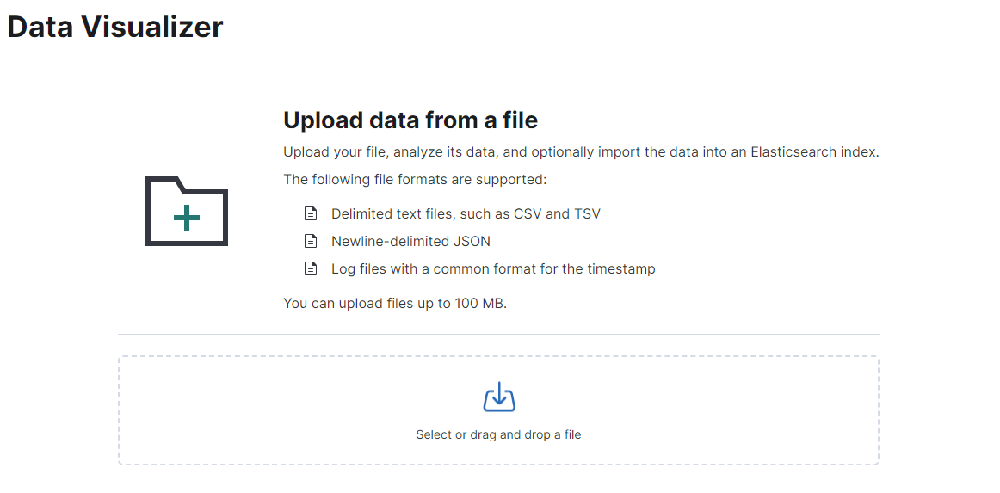

展開したファイルをData Visualizerにアップロードします。

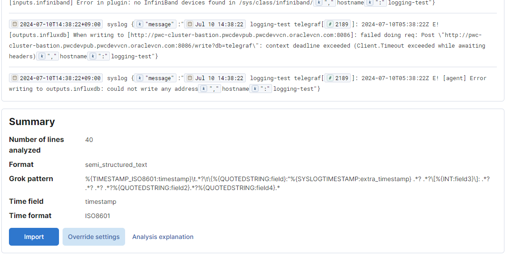

中段の「Import」を選択します。

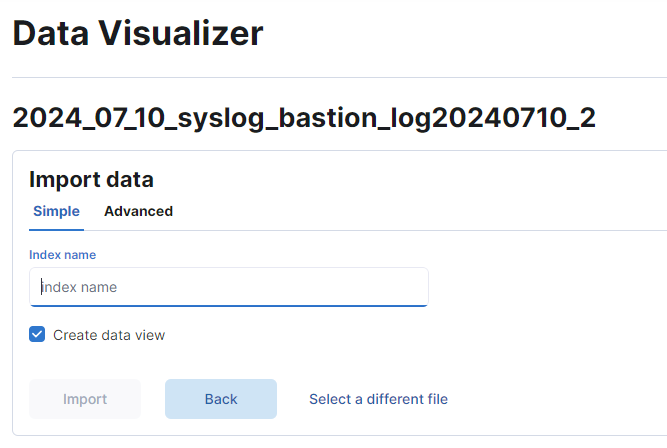

インデックス名を指定してデータをインデックス化します（例: uploaded-oci-test）。

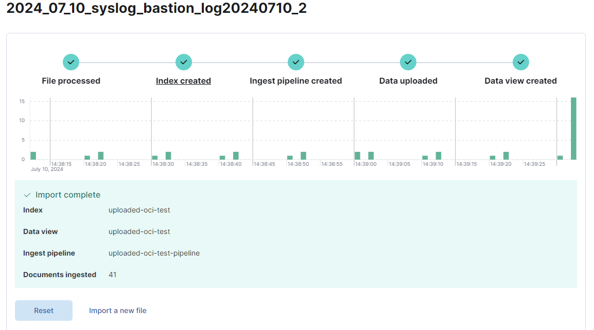

Data ViewまでできたらOKです。

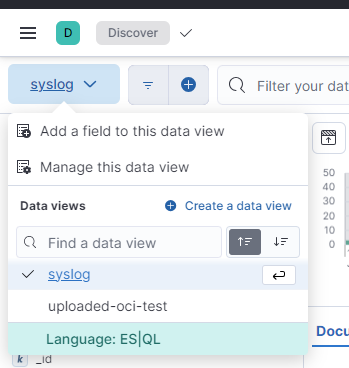

Kibanaの「Discover」から作成したインデックスを指定し、ログを可視化します。

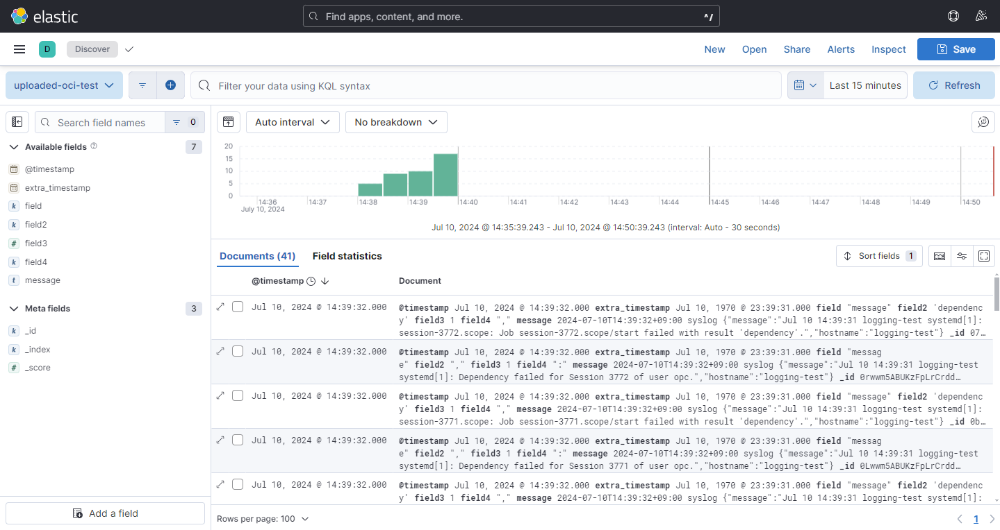

### 13.4 インデックスの削除

使い終わったインデックスはKibanaの「Stack Management」から削除して、システムの整理を行います。

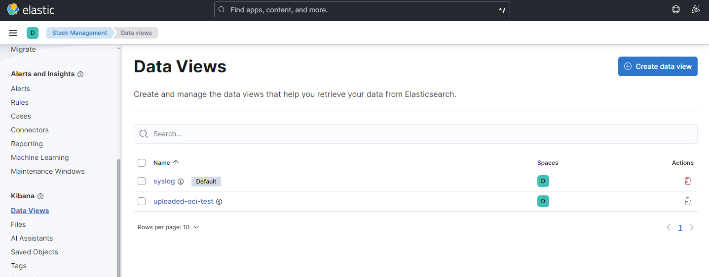