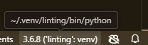

## Flake8 の概要

Flake8 は Python コードのスタイルガイドやプログラミングのベストプラクティスに基づいて、コードを自動的にチェックするためのツールです。具体的には、Python コードの PEP 8（Python のスタイルガイド）準拠をチェックし、コードの品質を高めるための静的解析を行います。

PEP 8 の考え方に、「コードは書かれるよりも読まれることのほうがはるかに多い」というものがあります。読みにくいコードは、複雑さや難しさの観点ももちろんありますが、コードの改行位置や空白の数、命名規則など、些細なところが気になり読みにくいことがよくあります。コーディング規約である PEP 8 を守ることでこの点を解決でき、さらにチェックをツールに任せることにより、人がチェックする労力を削減できることも Flake8 の大きな利点となります。

Flake8 を実行すると、これら 3 つのツールの観点でソースコードに対しチェックを行います。

- pycodestyle: PEP 8 に準拠しているかどうかをチェックします。
- Pyflakes: 未使用の変数やインポート、不正なコード構造などを検出します。これにより、エラーやバグの発見に役立ちます。
- McCabe: 関数の複雑度（サイクロマティック複雑度）を計測します。これにより、コードがあまりにも複雑でないかをチェックできます。

Flake8 で表示されるエラーコードの先頭一文字目は、エラーを検出したツールの種類（pycodestyle, Pyflakes, McCabe）を表しています。

| エラーコード | ツール                   |
| ------------ | ------------------------ |
| E/W          | pycodestyle によるエラー |
| F            | Pyflakes によるエラー    |
| C            | McCabe によるエラー      |

## プラグインを利用したより便利な Flake8 の利用

Flake8 にはチェック機能を強化するプラグインがあります。プラグインを利用することで、より多くの観点での静的解析が可能です。以下に、プラグインの一部を紹介します。

| プラグイン名        | 概要                                           |
| ------------------- | ---------------------------------------------- |
| flake8-import-order | import の順序をチェックする                    |
| pep8-naming         | PEP 8 の命名規約に準拠しているかをチェックする |
| flake8-commas       | カンマの位置をチェックする                     |
| flake8-quotes       | クォートをチェックする                         |
| flake8-docstrings   | docstring の有無や書き方をチェックする         |
| flake8-print        | print 関数の不要な使用をチェックする           |

Flake8 のプラグインの使い方は非常に簡単です。pip コマンドでプラグインをインストールし、flake8 コマンドを実行するだけで、そのプラグインツールでのチェックを行うことができます。

## Micorosoft VSCode での Flake8 の利用

Flake8 によるチェックのタイミングを人間の判断に任せていると、チェックを忘れてしまうことがよくあります。Flake8 も Black や mypy と同様に自動でチェックする仕組みを作るのがおすすめです。自動でチェックする方法はいくつかありますが、エディターでのチェックと、CI（継続的インテグレーション）でのチェックを併用して運用すると良いと思います。

Microsoft VSCode においては、`python.linting.flake8Enabled`という設定を有効化すると Flake8 をエディターに統合して利用することができます。

まずは、Flake8 およびプラグインツールをインストールするための Python 仮想環境を作成します。

```bash
mkdir -p ~/.venv
python3 -m venv ~/.venv/linting
source ~/.venv/linting/bin/activate

(linting) pip install -U pip
(linting) pip install flake8 flake8-import-order pep8-naming flake8-commas flake8-quotes flake8-docstrings flake8-print
```

次に、VSCode の`settings.json`をプロジェクトルートディレクトリ配下の`.vscode/`ディレクトリにに配置して、以下のように記述します。

```json
{
  "python.linting.enabled": true,
  "python.linting.flake8Enabled": true,
  "python.linting.flake8Path": "~/.venv/linting/bin/flake8"
}
```

Python 拡張機能がまだ VSCode にインストールされていない場合は、インストールを行います。`Ctrl + Shift +X`から拡張機能を開き、Python と入力してインストールを行います。

次に、作成した Python 仮想環境の Python インタープリターを選択します。`Ctrl + Shift + P`からコマンドパレットを開き「Python: Select Interpreter」と入力し、Python: Select Interpreter を選択します。適切な Python インタープリタ（仮想環境など）を選択します。

VSCode 右下にある Python インタープリターの表示が以下のようになっていれば良いです。


