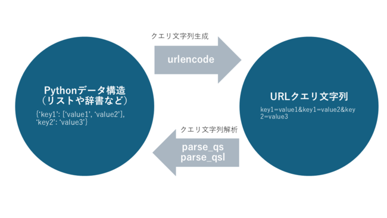

## 概要

Web 開発や API 通信において、URL のクエリ文字列は、データの送受信やリソースの指定に欠かせない要素です。Python では、標準ライブラリの`urllib.parse`モジュールを活用することで、これらのクエリ文字列を効率的に生成・解析できます。

本記事では、`urllib.parse`モジュールを用いたクエリ文字列の生成と解析の方法について詳しく解説します。

## `urllib.request` の基本

## URL クエリ文字列とは

URL クエリ文字列（クエリパラメータ）とは、URL の中で`?`以降に続く部分を指し、キーと値のペアが`&`で連結された形式を取ります。たとえば：

```
https://www.example.com/search?q=python&sort=recent
```

この URL では、`q=python&sort=recent`がクエリ文字列です。この部分は、検索キーワードやフィルタリング条件など、サーバーに送信する追加情報を含むことが一般的です。

## Python でのクエリ文字列の生成

Python の`urllib.parse`モジュールには、クエリ文字列を生成するための関数として`urlencode`が用意されています。この関数を使用することで、辞書やリストなどのデータ構造からクエリ文字列を簡単に作成できます。

### `urlencode`関数の基本的な使い方

```python
from urllib.parse import urlencode

# 辞書データ
data = {'key1': ['value1', 'value2'], 'key2': 'value3'}

# クエリ文字列にエンコード
query_string = urlencode(data, doseq=True)
print(query_string)
# 出力: key1=value1&key1=value2&key2=value3
```

- **`doseq=True`**: 値がリストやタプルの場合、各要素を個別の`key=value`ペアとしてエンコードします。

## Python でのクエリ文字列の解析

URL からクエリ文字列を解析し、Python のデータ構造に変換する際には、`urllib.parse`モジュールの`parse_qs`および`parse_qsl`関数が役立ちます。

### `parse_qs`関数

```python
from urllib.parse import parse_qs

query_string = 'key1=value1&key1=value2&key2=value3'
parsed_dict = parse_qs(query_string)
print(parsed_dict)
# 出力: {'key1': ['value1', 'value2'], 'key2': ['value3']}
```

- 同じキーが複数存在する場合、対応する値がリストとしてまとめられます。

### `parse_qsl`関数

```python
from urllib.parse import parse_qsl

query_string = 'key1=value1&key1=value2&key2=value3'
parsed_list = parse_qsl(query_string)
print(parsed_list)
# 出力: [('key1', 'value1'), ('key1', 'value2'), ('key2', 'value3')]
```

- クエリパラメータの順序が保持されるため、順序が重要な場合に有効です。

## `urlencode`と`parse_qs`/`parse_qsl`の相互関係

`urlencode`と`parse_qs`、および`parse_qsl`は、形式の差や順序などの違いはありますが、互いに逆操作として機能します。大まかなイメージだけでも掴んでおくと理解しやすいです。



```python
from urllib.parse import urlencode, parse_qs, parse_qsl

data = {'key1': ['value1', 'value2'], 'key2': 'value3'}
query_string = urlencode(data, doseq=True)

# parse_qsで解析
parsed_qs = parse_qs(query_string)
print(parsed_qs)
# 出力: {'key1': ['value1', 'value2'], 'key2': ['value3']}

# parse_qslで解析
parsed_qsl = parse_qsl(query_string)
print(parsed_qsl)
# 出力: [('key1', 'value1'), ('key1', 'value2'), ('key2', 'value3')]
```

## まとめ

- **`urlencode`**: Python の辞書やシーケンスをクエリ文字列に変換する。
- **`parse_qs`**: クエリ文字列を辞書形式で解析し、値はリストで保持する。
- **`parse_qsl`**: クエリ文字列を(キー, 値)のリスト形式で解析し、順序を保持する。

これらの関数を理解し適切に使用することで、URL クエリパラメータの操作が容易になります。
