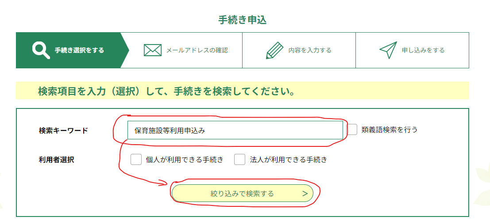
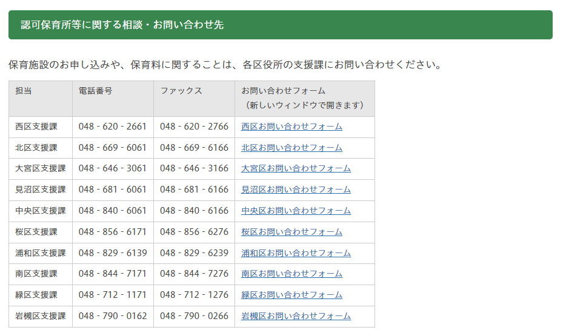
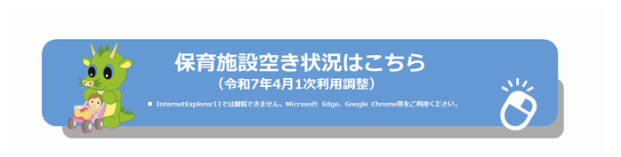
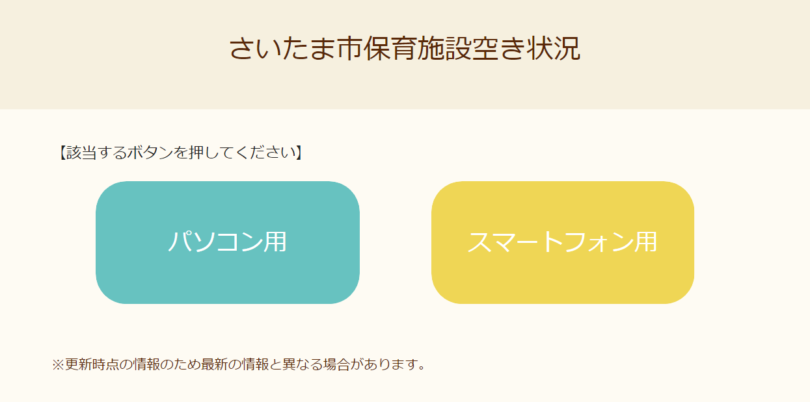
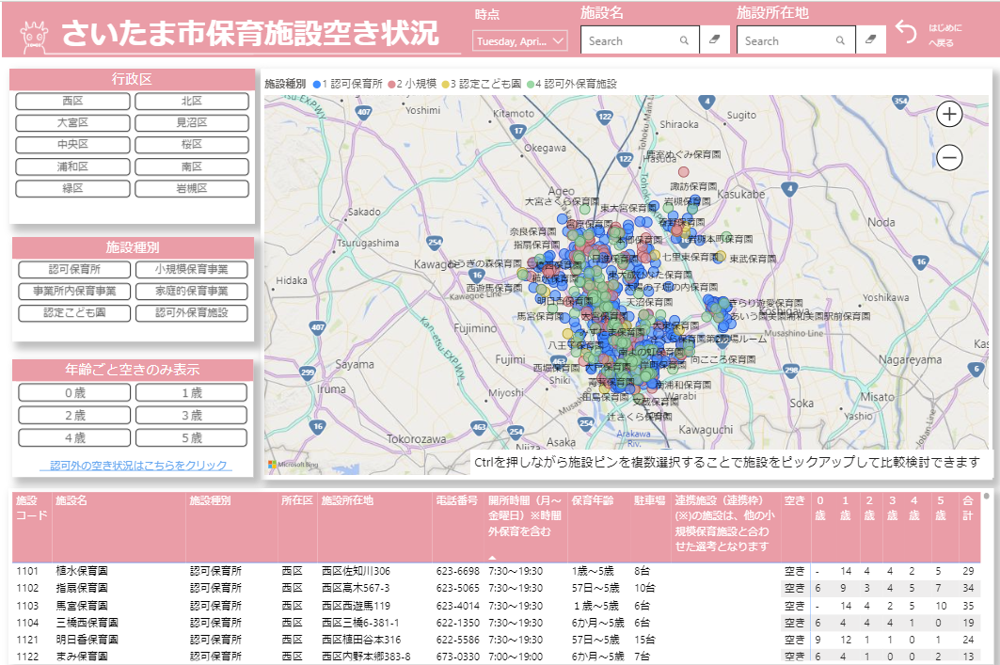
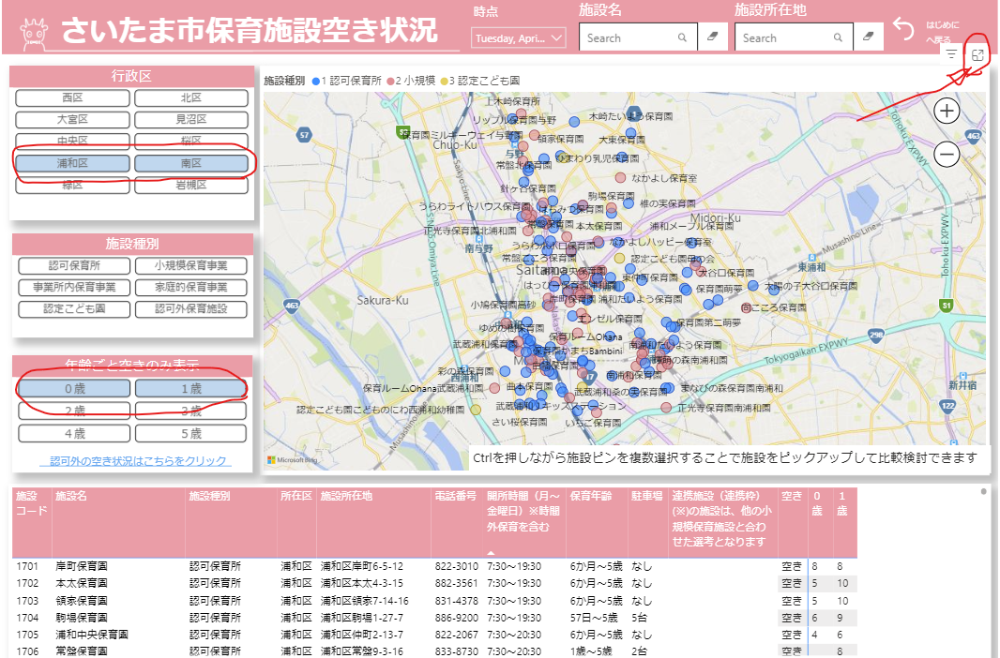
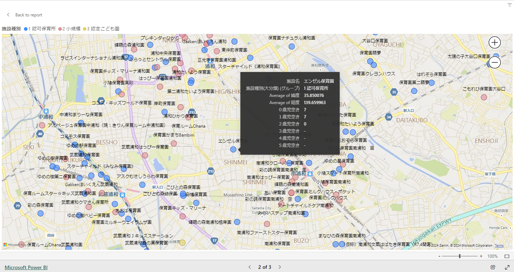
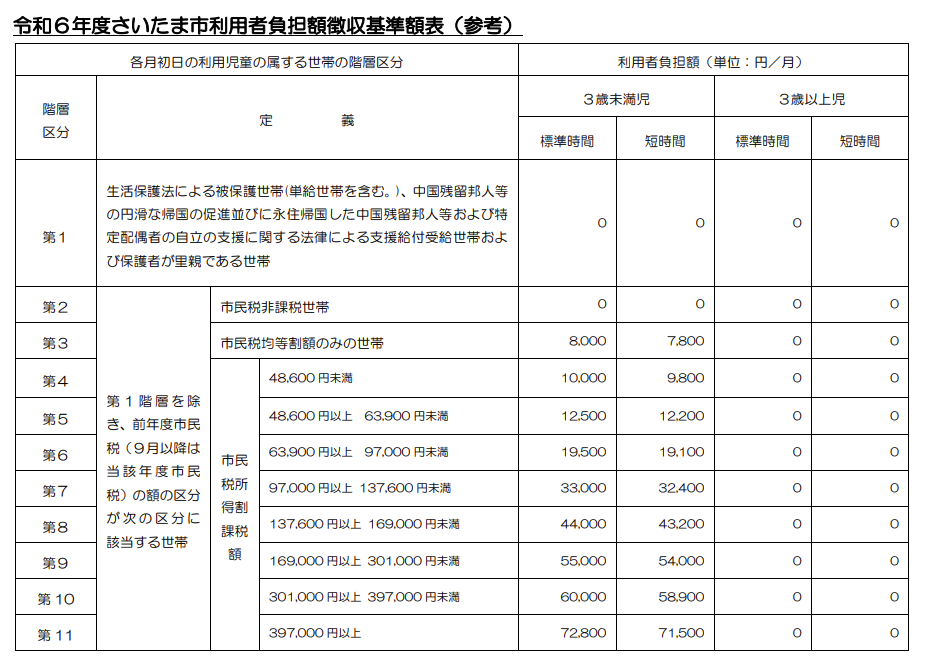

1 歳児と 0 歳児の兄妹をさいたま市の認可保育園に入園させるため、オンラインで申請手続きを行いました。その際に情報収集や申請方法に苦労したため、これから新年度入園のオンライン申請を行う方に向けてアドバイスをまとめたいと思います。

## 申請方法について

まず、さいたま市の保育施設利用の申し込みは次の 3 パターンがあります。

- オンライン申請
- 郵送
- 各区役所支援課または第一希望保育園に直接書類を提出

この 3 パターンが可能ですが、私はオンライン申請を選びました。各区役所支援課または第一希望保育園に直接書類を提出する場合、書類の不備をチェックする手間が発生したり、窓口が混み合う可能性があるため、オンライン申請または郵送をおすすめします。

ただし、オンライン申請にはマイナンバーカードによる電子署名が必要で、マイナンバーカードを読み取れる IC カードリーダーが必要です。

## オンライン申請について

オンラインでの申請を行うには、[さいたま市 オンライン市役所](https://apply.e-tumo.jp/city-saitama-u/offer/offerList_initDisplay.action)から申請手続きを行います。

- [さいたま市 オンライン市役所](https://apply.e-tumo.jp/city-saitama-u/offer/offerList_initDisplay.action)

ログインしたら、手続き申込の欄から、検索キーワードに「保育施設等利用申込み」と入力して絞り込みで検索を行い、該当の手続きを検索します。

### 電子署名について

保育園利用のためオンライン申請を行う際に、電子署名が必要になります。電子署名には、マイナンバーカードを読み取れるカードリーダーが必要です。対応しているスマートフォンの機種であれば問題ありませんが、比較的最新のものしか対応しておりません。

どの機種が対応しているのかについては、以下のページなどを参照してください：

- [さいたま市／オンライン市役所さいたま（電子申請・届出サービス）](https://www.city.saitama.lg.jp/001/915/017/p011055.html)
- [操作マニュアル](https://apply.e-tumo.jp/help/PREFST/index.htm)の「第 6 章 電子署名」
- [IC カードリーダライタのご用意 | 公的個人認証サービス ポータルサイト](https://www.jpki.go.jp/prepare/reader_writer.html)

ちなみに、私はスマートフォンが対応していなかったためマイナンバーカードに対応している IC カードリーダーを別途購入しました。保育園利用だけではなく、確定申告などでも今後お世話になりそうです。

[IC カードリーダー Q-ZIORE](https://amzn.to/3YcJuRM)

電子署名を行う際に、JPKI から提供されているソフトウェア（Windows 用、および Google Chrome 拡張機能）のインストールが必要になります。段階を踏んで導入してください。詳しくは以下のページを参照してください：

[マイナンバーカードのご用意 | 公的個人認証サービス ポータルサイト](https://www.jpki.go.jp/prepare/juki.html)

## コンシェルジュのお問い合わせ先について

保育園の利用申請はいわば情報戦です。情報が錯綜していたり、保育園の空き状況、利用申請の書き方、申請の仕方など分からないことが多いと思います。そのような時に相談に乗ってくれる窓口として、コンシェルジュが用意されています。

以下のページから該当年度の保育施設利用の申し込みに行き、認可保育所等に関する相談・お問い合わせ先の各支援課のお問い合わせフォームに内容を記載して送信すると、記載した連絡先に後程連絡が届く形になります。

[さいたま市／保育施設](https://www.city.saitama.lg.jp/003/001/015/001/index.html)

私も何点か分からないことがあったので利用しましたが、忙しい場合、回答に数営業日かかることもありました。

## 保育利用申し込みの期日や詳細内容について

こちらはさいたま市の[「保育施設の利用申し込みについて」](https://www.city.saitama.lg.jp/003/001/015/001/index.html)というページに提示されいてる手引きを確認します。詳細内容はこちらの手引きや他の人のブログ記事などに解説を譲ります。

特に注意すべきこととして、**1 次調整の申請期日は毎年 10 月下旬の 2 週間程度とタイトなスケジュールになっています**。1 次調整の申請に間に合わないと、2 次調整になってしまい希望の園に入園できない可能性が高くなってしまうため、必ず 1 次調整の申請に間に合うようにしましょう。なお、1 次調整の申請の申込内容変更申請は 11 月まで間に合います。

必要書類等は手引きを確認してあらかじめ用意しておきます。オンライン申請ページから必要書類を添付して送信し手続きを行います。

## 保育園の空き状況リストについて

さいたま市の認可保育園の空き状況、および認可外保育園の空き状況は以下のリンクから確認できます：

- [さいたま市 認可保育園空き状況](https://www.city.saitama.lg.jp/003/001/015/001/p097822.html)
- [さいたま市 認可外保育園空き状況](https://www.city.saitama.lg.jp/kosodate/shiritai/category8/p105052.html)

特に、新年度入園のための認可保育園の空き状況は、Microsoft Power BI で整理されたページがあり、非常にわかりやすいです。

[さいたま市 認可保育園空き状況](https://www.city.saitama.lg.jp/003/001/015/001/p097822.html)のページから以下の図のような画像をクリックします。

パソコン用をクリックします。

すると、以下のようなマップと空き状況が詳細に確認できるページ さいたま市保育園の空き状況 Microsoft PowerBI に飛びます。

このツールですが、左側から行政区、施設種別、年齢ごとの空きのみ表示をそれぞれ選択して、対象の保育園をフィルターしてから使います。

例えば、浦和区、南区の 0 歳、1 歳に絞ります。

フィルターしたら、マップの上にカーソルを持っていき、右上の画像を拡大ボタンをクリックします。

画像が拡大されました。マウスホイールでマップ上を拡大縮小表示でき、また保育園の上にマウスオーバーでその保育園の 0 歳～ 5 歳までの空き状況を確認することができます。例として、以下はエンゼル保育園の空き状況を確認しています。

## 保育指数について

保育指数とは、保育園の入園を決定する際に利用される点数のことです。この点数が高ければ高いほど、希望の園に受かりやすくなります。保育指数の基準表「保育施設利用調整基準表」は、
「保育施設利用の申込みについて」のページから確認できます。

こちらについても、以下のページから該当年度の「保育施設利用の申込みについて」のページにアクセスすると確認できます。

[さいたま市／保育施設](https://www.city.saitama.lg.jp/003/001/015/001/index.html)

保育指数 62 点がボーダーだと言われており、62 点以上あれば希望園に入園できる確率がかなり上がってくるようです。ただし、ネット上の情報でありさいたま市が公式に点数を公表している訳ではないので定かではありません。保育指数 62 というのは両親がフルタイムで一子を園に入園させる場合を想定しているようです。

このため、申請する前に保育指数をいかに上げておくかが重要になるわけですが、保育指数は基本的に子供の保育状況と両親の就労状況等によって決まるものであり、簡単には上げられるようなものではありません。

しかし、一つだけ無理やり上げることができるものがあるとするならば、保育状況に関連する部分であり、認可外保育園に預けていると「ナーサリールームその他の認可外保育施設に委託中」が適用され保育指数が 7 となり保育状況の中では最大の点数となります。1 点が大きな差を生むため、希望する園に入園する確率を最大限上げるには、認可外保育園に預けておくことをおすすめします。

### 認可外保育園に預けて保育指数を上げる

認可外保育園に預けて保育指数を上げるには、新年度入園申請の 10 月、遅くても変更申請を行うことができる 11 月末までに契約していることです。

※ ちなみに、「ナーサリールームその他の認可外保育施設に委託中」とは、どの程度利用しているとこの条件に満たしていると言えるかについて保育コンシェルジュに確認したところ、週 3 日以上だそうでした。月 1 で利用しているからと言って、条件が満たされる訳ではないようです。（申請された方々を隈なくチェックしているかと言われたら疑問ですが、念のため週 3 日以上は認可外保育園に預けておくべきでしょう。）

## 利用者負担額階層区分

認可保育所の利用料金（基本料金）はさいたま市に納付します。園によってはお稽古などで別途料金がかかると思いますが、この認可保育所の利用料金（基本料金）はどの認可保育所でも一律にかかってくるものになります。

この利用料金ですが、世帯の市民税額（父母の合算額）によって決定されます。

簡単に言うと、父親と母親の市民税所得課税を合計した額が、どの階層区分に該当するかで利用料金が決定されます。市民税所得課税ですが、おそらく住民税の通知書に記載されている、市民税の内訳の所得割額 ⑥ にあたります。

また、多子世帯や一人親世帯などの場合、利用者負担額が減額されます。詳しくは手引きの利用者負担額についてを参照してください。
