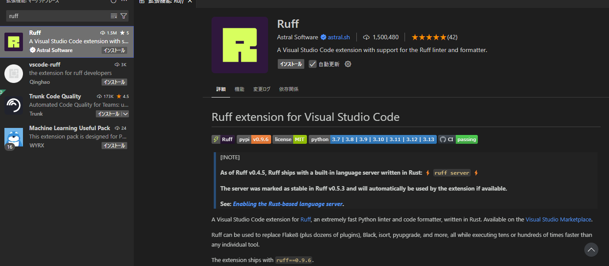

Python のプロジェクト開発において、コードの見た目の統一や品質管理は非常に重要です。

従来は、Black や Flake8 など複数のツールを組み合わせて使用していました。

- Black: Black はコードフォーマッターであり、コードのスタイルを自動的に整形します。PEP 8 に準拠したフォーマットを適用し、開発者間で一貫したコードスタイルを維持することができます。例えば、関数の引数間のスペースやインデントの統一などを自動で行います。
- Flake8: 静的コード解析ツール（リンター）で、コード内の潜在的なバグやスタイル違反を検出します。未使用の変数やインポート、適切でないインデントなど、コードの品質や可読性に影響を与える問題を指摘します。また、プラグインを追加することで、機能を拡張することも可能です。

このように、開発の際に、最初に Black でフォーマッティングを行い、その上で Flake8 で静的解析を行うのが主流でした。

Ruff は Black のフォーマッティングと Flake8 の静的解析の機能を統合し、高速に動作する新しいツールとして最近注目されています。

本記事では、Visual Studio Code（VSCode）上で Ruff を活用し、コードフォーマットと静的解析を自動化するための詳細な手順と設定方法を解説します。

- [Ruff - Visual Studio Marketplace](https://marketplace.visualstudio.com/items?itemName=charliermarsh.ruff&utm_source=chatgpt.com)

## Ruff とは？

**Ruff**は Rust で実装された Python 用のリンター兼フォーマッターです。

以下の特徴があります。

- **高速動作**：従来のツールに比べて処理速度が非常に速い
- **多機能統合**：Flake8、Black、isort、pyupgrade などの機能を 1 つにまとめ、個別のツールを導入する手間を省く
- **シンプルな設定**：`pyproject.toml`に設定をまとめ、プロジェクトごとにルールを統一できる

## VSCode への Ruff の導入

早速 VSCode に Ruff を導入してみましょう。VSCode で Ruff を利用するためには、2 つの方法があります。

1. **VSCode 拡張機能**として Ruff をインストールする
2. **Python 環境に Ruff をインストールする（オプション）**

Python 環境に Ruff をインストールするのはオプションです。プロジェクト固有のルールで Ruff を設定する場合に利用するには Python 環境に Ruff を入れます。基本的なコードチェックやフォーマットであれば、VSCode のバンドルされた Ruff だけで十分です。

### VSCode 拡張機能のインストール

1. **拡張機能ビューの起動**

   - サイドバーの四角形アイコン、または `Ctrl + Shift + X`（macOS は `Cmd + Shift + X`）を押します。

2. **「Ruff」で検索**
   - 検索結果に表示される拡張機能（例: **Ruff** by Astral Software）をインストールします。



### Python 環境への Ruff のインストール（オプション）

VSCode 拡張機能のみでも利用は可能ですが、プロジェクトごとに異なるバージョンや高度な設定を行いたい場合は、Python 環境（仮想環境など）に Ruff をインストールすることを推奨します。

1. **ターミナルの起動**

   - VSCode のメニューから「ターミナル > 新しいターミナル」を選択

2. **仮想環境の作成（推奨）**

   ```bash
   python -m venv env
   ```

   - 作成した仮想環境を有効化します（OS に応じてコマンドが異なります）。

3. **Ruff のインストール**
   ```bash
   pip install ruff
   ```

この方法でインストールした Ruff は、VSCode 設定で利用するように切り替えることも可能です。  
たとえば、`settings.json`で

```json
{
  "ruff.importStrategy": "fromEnvironment"
}
```

と指定すると、システムや仮想環境にインストールされた Ruff を使用します。

## プロジェクト設定：pyproject.toml の活用

VSCode 上で Ruff をプロジェクト固有のルールで運用するためには、ルートディレクトリに設定ファイル `pyproject.toml` を配置します。

### pyproject.toml の作成例

以下は基本的な設定例です。必要に応じてルールや無視設定を追加してください。

```toml
[tool.ruff]
line-length = 88             # 1行の最大文字数
target-version = "py39"        # 対象とするPythonのバージョン
select = ["E", "F", "I", "B", "C4", "UP"]  # 有効にするLintルール
ignore = ["E501", "B008"]      # 無視するルールの指定
```

**ポイント**:

- この設定により、プロジェクト全体で一貫した Linting とコードフォーマットルールが適用されます。
- Ruff は、`pyproject.toml`が存在する場合にその設定を自動的に読み込みます。

## VSCode の設定：settings.json の構成

VSCode の設定ファイル（`.vscode/settings.json`）を編集して、Ruff を効果的に利用できるようにします。

### 基本設定例

以下は、Python ファイル保存時に自動でコードフォーマットと Lint 修正を実行する設定例です。

```json
{
  "[python]": {
    "editor.formatOnSave": true,
    "editor.defaultFormatter": "charliermarsh.ruff",
    "editor.codeActionsOnSave": {
      "source.fixAll": true,
      "source.organizeImports": true
    }
  },
  "ruff.linting.enabled": true,
  "ruff.configPath": "${workspaceFolder}/pyproject.toml",
  "ruff.configSource": "filesystemFirst"
}
```

**各設定項目の解説**:

- `"editor.formatOnSave": true`  
  保存時に自動でフォーマットを実行する設定です。
- `"editor.defaultFormatter": "charliermarsh.ruff"`  
  Ruff をデフォルトのフォーマッターとして指定します。
- `"editor.codeActionsOnSave": { "source.fixAll": true, "source.organizeImports": true }`  
  保存時に自動でコードの修正およびインポートの整理を行います。
- `"ruff.linting.enabled": true`  
  VSCode 上で Ruff による Lint チェックを有効にします。
- `"ruff.configPath": "${workspaceFolder}/pyproject.toml"`  
  プロジェクトのルートにある設定ファイルを読み込むよう指定します。
- `"ruff.configSource": "filesystemFirst"`  
  ファイルシステム上の設定（pyproject.toml など）を優先させる設定です。  
  ※ これにより、VSCode のデフォルト設定よりもプロジェクト固有の設定が反映されます。

## 利用例とカスタマイズ

### 自動フォーマットの動作確認

VSCode で Python ファイルを編集し、保存（Ctrl+S または Cmd+S）すると、Ruff が自動でコードフォーマットと Lint 修正を実行します。

- インデントや改行、不要なスペースの整理が行われ、コードが整然とします。

### エラーや警告の確認

ファイル内にルール違反がある場合、VSCode の「問題」パネルに警告やエラーが表示されます。

- これにより、リアルタイムでコードの品質を維持でき、潜在的なバグを早期に発見できます。

### 高度なカスタマイズ

プロジェクトごとに細かいルールの調整が必要な場合、`pyproject.toml`で設定をカスタマイズします。

- 例: 特定のエラーコードを無視する、特定のルールのみを有効にするなど。
- 詳細は[Ruff の公式ドキュメント](https://docs.astral.sh/ruff/configuration/)を参照してください。

## まとめ

VSCode で Ruff を活用することで、以下のメリットが得られます：

- **高速なコードフォーマット**：保存時に自動でコードが整形され、可読性が向上します。
- **静的解析の自動化**：Lint 警告やエラーをリアルタイムで把握でき、バグの早期発見につながります。
- **プロジェクト固有のルール管理**：`pyproject.toml`を用いて、チーム全体で一貫したコードスタイルを維持できます。
- **シンプルな設定**：VSCode の拡張機能と設定ファイルを用いることで、導入や運用が容易になります。
